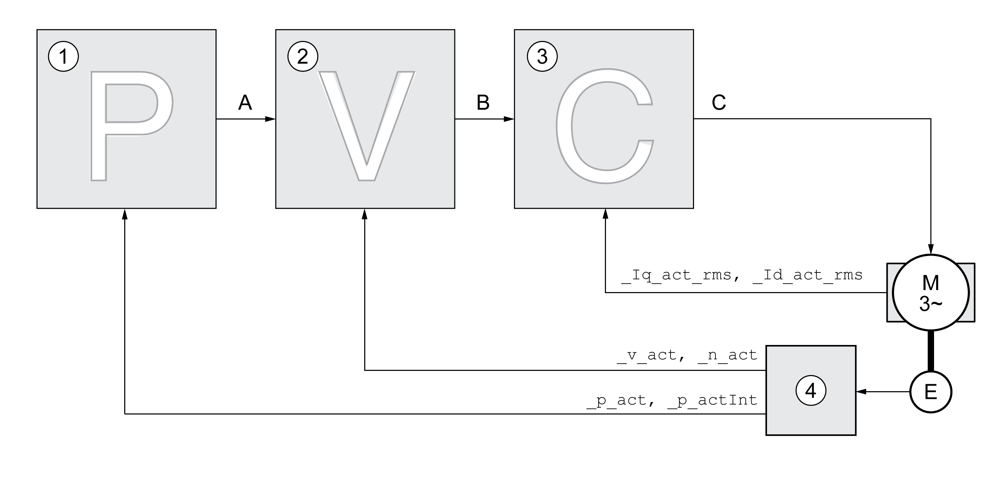

# Controller Structure

## Overview

The controller structure corresponds to the classical cascaded closed loop with current controller, velocity controller and position controller. In addition, the reference value of the velocity controller can be smoothed via a filter.

The controllers are tuned one after the other from the "inside" to the "outside" in the following sequence: current control, velocity control, position control.

**1** Position controller

**2** Velocity controller

**3** Current controller

**4** Encoder evaluation

See section [Overview of the Controller Structure](OverviewOfTheControllerStructure-C5176D54.html#OverviewOfTheControllerStructure-C5176D54) for a detailed description of the controller structure.

## Current Controller

The current controller determines the torque of the motor. The current controller is automatically optimally tuned with the stored motor data.

## Velocity Controller

The velocity controller controls the motor velocity by varying the motor current depending on the load situation. The velocity controller has a decisive influence on the dynamic response of the drive. The dynamics of the velocity controller depend on:

* Moment of inertia of the drive and the controlled system
* Power of the motor
* Stiffness and elasticity of the elements in the flow of forces
* Backlash of the drive elements
* Friction

## Position Controller

The position controller reduces the difference between the reference position and the actual position of the motor (position deviation) to a minimum. When the motor is at a standstill, the position deviation is close to zero in the case of a well-tuned position controller.

An optimized velocity control loop is a prerequisite for good amplification of the position controller.

## Control Loop Parameters

This device allows you to use two control loop parameter sets. It is possible to switch form one set of control loop parameter sets to the other during operation. The active control loop parameter set is selected with the parameter CTRL\_SelParSet.

The corresponding parameters are CTRL1\_xx for the first control loop parameter set and CTRL2\_xx for the second control loop parameter set. The following descriptions use the notation CTRL1\_xx (CTRL2\_xx) if there are no functional differences between the two control loop parameter sets.

| Parameter name  HMI menu  HMI name | Description | Unit  Minimum value  Factory setting  Maximum value | Data type  R/W  Persistent  Expert | Parameter address via fieldbus |
| --- | --- | --- | --- | --- |
| CTRL\_SelParSet | Selection of control loop parameter set.  Coding see parameter: CTRL\_PwrUpParSet  Type: Unsigned decimal - 2 bytes  Write access via Sercos: CP2, CP3, CP4  Modified settings become active immediately. | -  0  1  2 | UINT16  R/W  -  - | Modbus 4402  IDN P-0-3017.0.25 |
| \_CTRL\_ActParSet | Active control loop parameter set.  Value 1: Control loop parameter set 1 is active  Value 2: Control loop parameter set 2 is active  A control loop parameter set is active after the time for the parameter switching (CTRL\_ParChgTime) has elapsed.  Type: Unsigned decimal - 2 bytes | -  -  -  - | UINT16  R/-  -  - | Modbus 4398  IDN P-0-3017.0.23 |
| CTRL\_ParChgTime | Period of time for control loop parameter set switching.  In the case of control loop parameter set switching, the values of the following parameters are changed linearly:  - CTRL\_KPn  - CTRL\_TNn  - CTRL\_KPp  - CTRL\_TAUnref  - CTRL\_TAUiref  - CTRL\_KFPp  Type: Unsigned decimal - 2 bytes  Write access via Sercos: CP2, CP3, CP4  Modified settings become active immediately. | ms  0  0  2000 | UINT16  R/W  per.  - | Modbus 4392  IDN P-0-3017.0.20 |

0198441114060.03

© 2021

Schneider Electric.

All rights reserved.