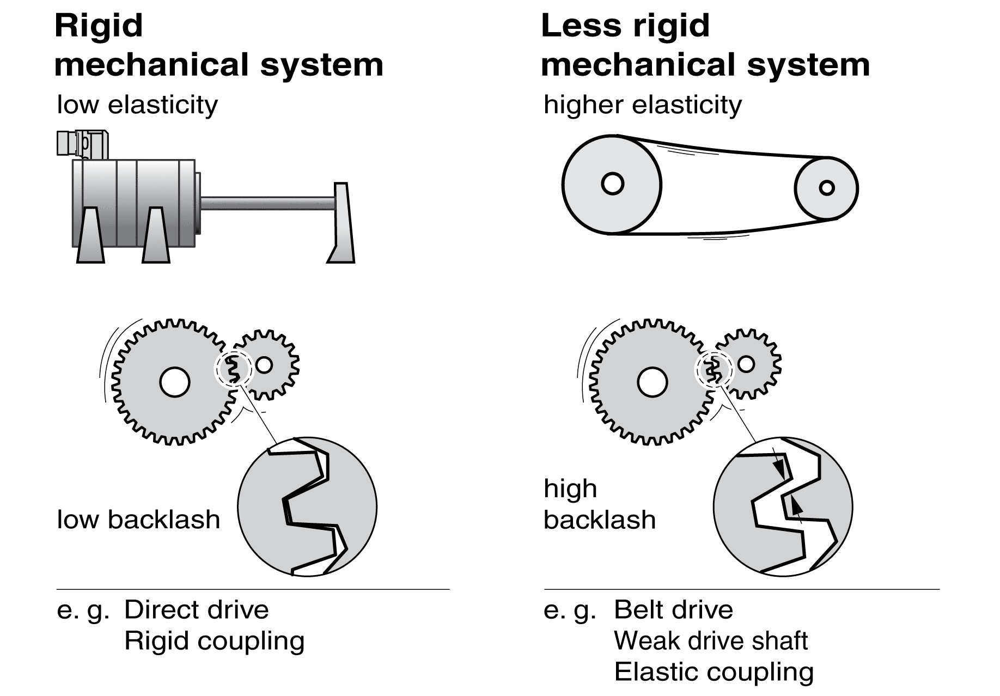
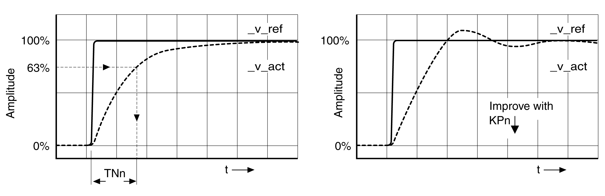

# Optimizing the Velocity Controller

## General

Optimizing complex mechanical control systems require hands-on experience with controller tuning. This includes the ability to calculate control loop parameters and to apply identification procedures.

Less complex mechanical systems can often be optimized by means of experimental adjustment using the aperiodic limit method. The following parameters are used for this:

| Parameter name  HMI menu  HMI name | Description | Unit  Minimum value  Factory setting  Maximum value | Data type  R/W  Persistent  Expert | Parameter address via fieldbus |
| --- | --- | --- | --- | --- |
| CTRL1\_KPn  ****(ConF)**** → ****(drC-)****  ****( Pn1)**** | Velocity controller P gain.  The default value is calculated on the basis of the motor parameters.  In the case of switching between the two control loop parameter sets, the values are changed linearly over the time defined in the parameter CTRL\_ParChgTime.  Type: Unsigned decimal - 2 bytes  Write access via Sercos: CP2, CP3, CP4  In increments of 0.0001 A/RPM.  Modified settings become active immediately. | A/RPM  0.0001  -  2.5400 | UINT16  R/W  per.  - | Modbus 4610  IDN P-0-3018.0.1 |
| CTRL2\_KPn  ****(ConF)**** → ****(drC-)****  ****( Pn2)**** | Velocity controller P gain.  The default value is calculated on the basis of the motor parameters.  In the case of switching between the two control loop parameter sets, the values are changed linearly over the time defined in the parameter CTRL\_ParChgTime.  Type: Unsigned decimal - 2 bytes  Write access via Sercos: CP2, CP3, CP4  In increments of 0.0001 A/RPM.  Modified settings become active immediately. | A/RPM  0.0001  -  2.5400 | UINT16  R/W  per.  - | Modbus 4866  IDN P-0-3019.0.1 |
| CTRL1\_TNn  ****(ConF)**** → ****(drC-)****  ****(tin1)**** | Velocity controller integral action time.  The default value is calculated.  In the case of switching between the two control loop parameter sets, the values are changed linearly over the time defined in the parameter CTRL\_ParChgTime.  Type: Unsigned decimal - 2 bytes  Write access via Sercos: CP2, CP3, CP4  In increments of 0.01 ms.  Modified settings become active immediately. | ms  0.00  -  327.67 | UINT16  R/W  per.  - | Modbus 4612  IDN P-0-3018.0.2 |
| CTRL2\_TNn  ****(ConF)**** → ****(drC-)****  ****(tin2)**** | Velocity controller integral action time.  The default value is calculated.  In the case of switching between the two control loop parameter sets, the values are changed linearly over the time defined in the parameter CTRL\_ParChgTime.  Type: Unsigned decimal - 2 bytes  Write access via Sercos: CP2, CP3, CP4  In increments of 0.01 ms.  Modified settings become active immediately. | ms  0.00  -  327.67 | UINT16  R/W  per.  - | Modbus 4868  IDN P-0-3019.0.2 |

Verify and optimize the calculated values in a second step, see [Verifying and Optimizing the P Gain](VerifyingAndOptimizingThePGain-C488E834.html#VerifyingAndOptimizingThePGain-C488E834).

## Reference Value Filter of the Velocity Controller

The reference value filter of the velocity controller allows you to improve the transient response at optimized velocity control. The reference value filter must be deactivated for the first setup of the velocity controller.

Deactivate the reference value filter of the velocity controller. Set the parameter CTRL1\_TAUnref (CTRL2\_TAUnref) to the lower limit value "0".

| Parameter name  HMI menu  HMI name | Description | Unit  Minimum value  Factory setting  Maximum value | Data type  R/W  Persistent  Expert | Parameter address via fieldbus |
| --- | --- | --- | --- | --- |
| CTRL1\_TAUnref  ****(ConF)**** → ****(drC-)****  ****(tAu1)**** | Filter time constant of the reference velocity value filter.  In the case of switching between the two control loop parameter sets, the values are changed linearly over the time defined in the parameter CTRL\_ParChgTime.  Type: Unsigned decimal - 2 bytes  Write access via Sercos: CP2, CP3, CP4  In increments of 0.01 ms.  Modified settings become active immediately. | ms  0.00  9.00  327.67 | UINT16  R/W  per.  - | Modbus 4616  IDN P-0-3018.0.4 |
| CTRL2\_TAUnref  ****(ConF)**** → ****(drC-)****  ****(tAu2)**** | Filter time constant of the reference velocity value filter.  In the case of switching between the two control loop parameter sets, the values are changed linearly over the time defined in the parameter CTRL\_ParChgTime.  Type: Unsigned decimal - 2 bytes  Write access via Sercos: CP2, CP3, CP4  In increments of 0.01 ms.  Modified settings become active immediately. | ms  0.00  9.00  327.67 | UINT16  R/W  per.  - | Modbus 4872  IDN P-0-3019.0.4 |

## Determining the Type of Mechanical System

To assess and optimize the transient response behavior of your system, group its mechanical system into one of the following two categories.

* System with rigid mechanical system
* System with a less rigid mechanical system

Rigid and less rigid mechanical systems

## Determining Values for Rigid Mechanical Systems

In the case of a rigid mechanical system, adjusting the control performance on the basis of the table is possible if:

* the moment of inertia of the load and of the motor are known and
* the moment of inertia of the load and of the motor are constant

The P gain CTRL\_KPn and the integral action time CTRL\_TNn depend on:

* JL: Moment of inertia of the load
* JM: Moment of inertia of the motor

* Determine the values on the basis of the following table:

|  | JL= JM | | JL= 5 \* JM | | JL= 10 \* JM | |
| --- | --- | --- | --- | --- | --- | --- |
| JL | KPn | TNn | KPn | TNn | KPn | TNn |
| 1 kgcm2 | 0.0125 | 8 | 0.008 | 12 | 0.007 | 16 |
| 2 kgcm2 | 0.0250 | 8 | 0.015 | 12 | 0.014 | 16 |
| 5 kgcm2 | 0.0625 | 8 | 0.038 | 12 | 0.034 | 16 |
| 10 kgcm2 | 0.125 | 8 | 0.075 | 12 | 0.069 | 16 |
| 20 kgcm2 | 0.250 | 8 | 0.150 | 12 | 0.138 | 16 |

## Determining Values for Less Rigid Mechanical Systems

For optimization purposes, determine the P gain of the velocity controller at which the controller adjusts velocity \_v\_act as quickly as possible without overshooting.

Set the integral action time CTRL1\_TNn (CTRL2\_TNn) to infinite (= 327.67 ms).

If a load torque acts on the motor when the motor is at a standstill, the integral action time must not exceed a value that causes unwanted changes of the motor position.

If the motor is subject to loads when it is at a standstill, setting the integral action time to "infinite" may cause position deviations (for example, in the case of vertical axes). Reduce the integral action time if the position deviation is unacceptable in your application. However, reducing the integral action time can adversely affect optimization results.

The step function moves the motor until the specified time has expired.

| WARNING | |
| --- | --- |
|  | UNINTENDED MOVEMENT  * Only start the system if there are no persons or obstructions in the zone of operation. * Verify that the values for the velocity and the time do not exceed the available movement range. * Verify that a functioning emergency stop push-button is within reach of all persons involved in the operation.  Failure to follow these instructions can result in death, serious injury, or equipment damage. |

* Trigger a step function.
* After the first test, verify the maximum amplitude for the reference value for the current \_Iq\_ref.

Set the amplitude of the reference value just high enough so the reference value for the current \_Iq\_ref remains below the maximum value CTRL\_I\_max. On the other hand, the value selected should not be too low, otherwise friction effects of the mechanical system will determine the performance of the control loop.

* Trigger another step function if you had to modify \_v\_ref and verify the amplitude of \_Iq\_ref.
* Increase or decrease the P gain in small increments until \_v\_act is obtained as fast as possible. The following diagram shows the required transient response on the left. Overshooting - as shown on the right - is reduced by reducing CTRL1\_KPn (CTRL2\_KPn).

Differences between \_v\_ref and \_v\_act result from setting CTRL1\_TNn (CTRL2\_TNn) to "Infinite".

Determining "TNn" for the aperiodic limit

In the case of drive systems in which oscillations occur before the aperiodic limit is reached, the P gain "KPn" must be reduced until oscillations can no longer be detected. This occurs frequently in the case of linear axes with a toothed belt drive.

## Graphic Determination of the 63% Value

Graphically determine the point at which the actual velocity \_v\_act reaches 63% of the final value. The integral action time CTRL1\_TNn (CTRL2\_TNn) then results as a value on the time axis. The commissioning software supports you with the evaluation:

| Parameter name  HMI menu  HMI name | Description | Unit  Minimum value  Factory setting  Maximum value | Data type  R/W  Persistent  Expert | Parameter address via fieldbus |
| --- | --- | --- | --- | --- |
| CTRL1\_TNn  ****(ConF)**** → ****(drC-)****  ****(tin1)**** | Velocity controller integral action time.  The default value is calculated.  In the case of switching between the two control loop parameter sets, the values are changed linearly over the time defined in the parameter CTRL\_ParChgTime.  Type: Unsigned decimal - 2 bytes  Write access via Sercos: CP2, CP3, CP4  In increments of 0.01 ms.  Modified settings become active immediately. | ms  0.00  -  327.67 | UINT16  R/W  per.  - | Modbus 4612  IDN P-0-3018.0.2 |
| CTRL2\_TNn  ****(ConF)**** → ****(drC-)****  ****(tin2)**** | Velocity controller integral action time.  The default value is calculated.  In the case of switching between the two control loop parameter sets, the values are changed linearly over the time defined in the parameter CTRL\_ParChgTime.  Type: Unsigned decimal - 2 bytes  Write access via Sercos: CP2, CP3, CP4  In increments of 0.01 ms.  Modified settings become active immediately. | ms  0.00  -  327.67 | UINT16  R/W  per.  - | Modbus 4868  IDN P-0-3019.0.2 |

0198441114060.03

© 2021

Schneider Electric.

All rights reserved.