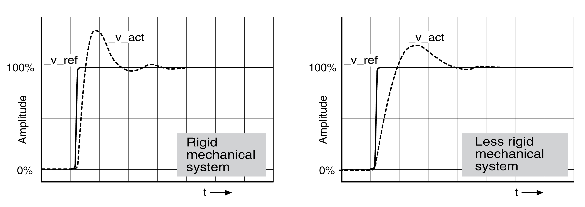
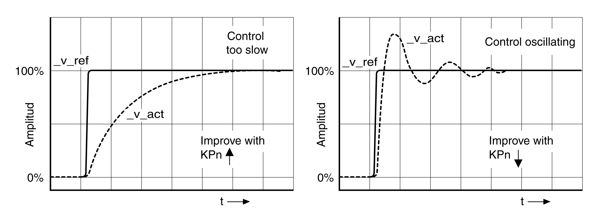

# Verifying and Optimizing the P Gain

## General

Step responses with good control performance

The controller is properly set when the step response is approximately identical to the signal shown. Good control performance is characterized by

* Fast transient response
* Overshooting with 20%, up to a maximum of 40%.

If the control performance does not correspond to the curve shown, change CTRL\_KPn in increments of about 10% and then trigger another step function:

* If the control is too slow: Use a higher CTRL1\_KPn (CTRL2\_KPn) value.
* If the control tends to oscillate: Use a lower CTRL1\_KPn (CTRL2\_KPn) value.

Oscillation ringing is characterized by continuous acceleration and deceleration of the motor.

Optimizing insufficient velocity controller settings

0198441114060.03

© 2021

Schneider Electric.

All rights reserved.