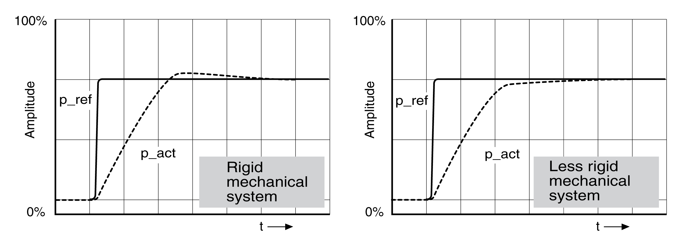
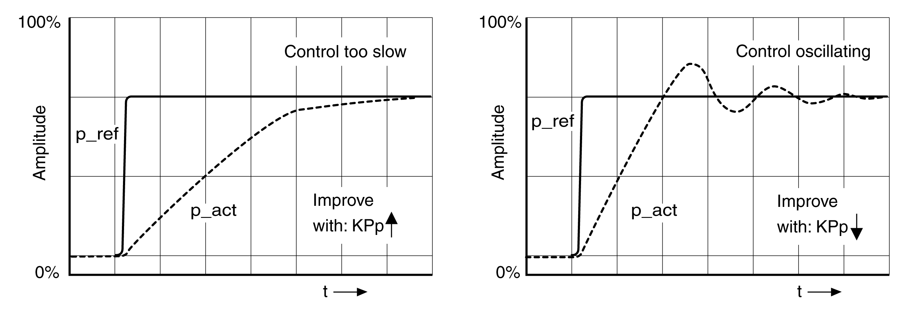

# Optimizing the Position Controller

## General

An optimized velocity controller is a prerequisite for optimization of the position controller.

When tuning the position controller, you must optimize the P gain CTRL1\_KPp (CTRL2\_KPp):

* CTRL1\_KPp (CTRL2\_KPp) too high: Overshooting, instability
* CTRL1\_KPp (CTRL2\_KPp) too low: High position deviation

| Parameter name  HMI menu  HMI name | Description | Unit  Minimum value  Factory setting  Maximum value | Data type  R/W  Persistent  Expert | Parameter address via fieldbus |
| --- | --- | --- | --- | --- |
| CTRL1\_KPp  ****(ConF)**** → ****(drC-)****  ****( PP1)**** | Position controller P gain.  The default value is calculated.  In the case of switching between the two control loop parameter sets, the values are changed linearly over the time defined in the parameter CTRL\_ParChgTime.  Type: Unsigned decimal - 2 bytes  Write access via Sercos: CP2, CP3, CP4  In increments of 0.1 1/s.  Modified settings become active immediately. | 1/s  2.0  -  900.0 | UINT16  R/W  per.  - | Modbus 4614  IDN P-0-3018.0.3 |
| CTRL2\_KPp  ****(ConF)**** → ****(drC-)****  ****( PP2)**** | Position controller P gain.  The default value is calculated.  In the case of switching between the two control loop parameter sets, the values are changed linearly over the time defined in the parameter CTRL\_ParChgTime.  Type: Unsigned decimal - 2 bytes  Write access via Sercos: CP2, CP3, CP4  In increments of 0.1 1/s.  Modified settings become active immediately. | 1/s  2.0  -  900.0 | UINT16  R/W  per.  - | Modbus 4870  IDN P-0-3019.0.3 |

The step function moves the motor until the specified time has expired.

| WARNING | |
| --- | --- |
|  | UNINTENDED MOVEMENT  * Only start the system if there are no persons or obstructions in the zone of operation. * Verify that the values for the velocity and the time do not exceed the available movement range. * Verify that a functioning emergency stop push-button is within reach of all persons involved in the operation.  Failure to follow these instructions can result in death, serious injury, or equipment damage. |

## Setting the Reference Value Signal

* Select Position Controller as the reference value in the commissioning software.
* Set the reference value signal:

* Signal type: "Step"
* Set the amplitude to approximately 1/10 motor revolution.

The amplitude is entered in user-defined units. With the default scaling, the resolution is 16384 user-defined units per motor revolution.

## Selecting the Trace Signals

* Select the values in the box General Trace Parameters:

* Reference position of position controller \_p\_refusr (\_p\_ref)
* Actual position of position controller \_p\_actusr (\_p\_act)
* Actual velocity \_v\_act
* Reference value current \_Iq\_ref

## Optimizing the Position Controller Value

* Trigger a step function with the default controller values.
* After the first test, verify the values achieved for \_v\_act and \_Iq\_ref for current control and velocity control. The values must not reach the current and velocity limitation range.

Step responses of a position controller with good control performance

The p gain setting CTRL1\_KPp (CTRL2\_KPp) is optimal if the reference value is reached rapidly and with little or no overshooting.

If the control performance does not correspond to the curve shown, change the P gain CTRL1\_KPp (CTRL2\_KPp) in increments of approximately 10% and trigger another step function.

* If the control tends to oscillate: Use a lower KPp value.
* If the actual value is too slow reaching the reference value: Use a higher KPp value.

Optimizing inadequate position controller settings

0198441114060.03

© 2021

Schneider Electric.

All rights reserved.