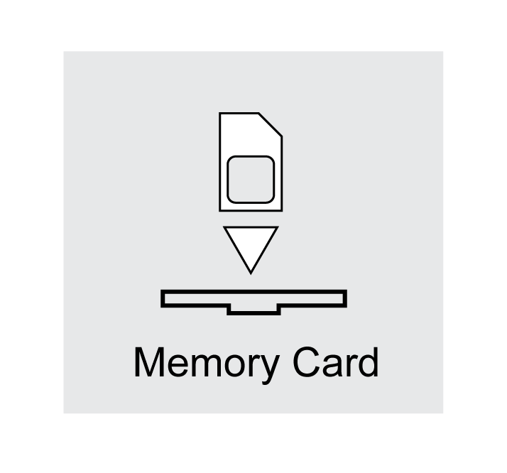
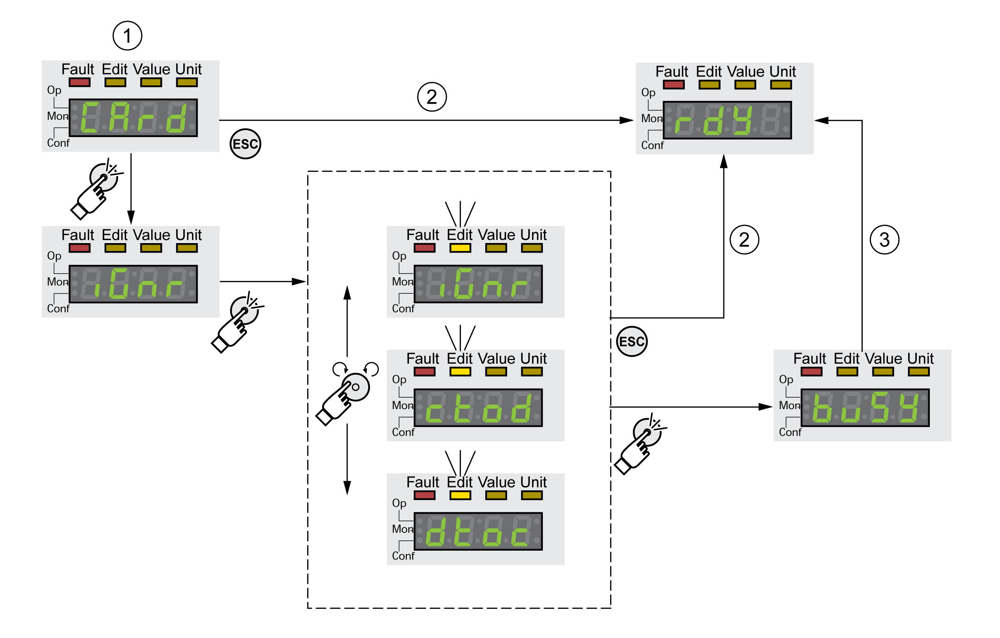

# Memory Card

## Description

The drives features a card holder for a memory card. The parameters stored on the memory card can be transferred to other drives. If a drive is replaced, a new drive of the same type can be operated with identical parameters.

The contents of the memory card is compared to the parameters stored in the drive when the drive is powered on.

When the parameters are written to the nonvolatile memory, they are also saved to the memory card.

The parameters of the safety module require special treatment. See the module manual of the safety module for additional information.

Note the following:

* Use only genuine accessory memory cards.
* Do not touch the gold contacts.
* The insert/remove cycles of the memory card are limited.
* The memory card can remain in the drive.
* The memory card can only be removed from the drive by pulling (not by pushing).

| NOTICE | |
| --- | --- |
|  | ELECTROSTATIC DISCHARGE OR INTERMITTENT CONTACT AND LOSS OF DATA  Do not touch the contacts of the memory card.  Failure to follow these instructions can result in equipment damage. |

## Inserting a Memory Card

* 24 Vdc control supply has been powered off.
* Insert the memory card into the drive with the gold contacts face down; the slanted corner must be face to the mounting plate.
* Power on the 24 Vdc control supply.
* Observe the 7-segment display during the initialization of the drive.

## **(**Card**)** is Displayed for a Short Period of Time

The drive has detected a memory card. User intervention is not required.

The parameter values stored in the drive and the contents of the memory card are identical. The data on the memory card originates from the drive into which the memory card is inserted.

## **(**Card**)** is Displayed Permanently

The drive has detected a memory card. User intervention is required.

| Cause | Options |
| --- | --- |
| The memory card is new. | The drive data can be transferred to the memory card. |
| The data on the memory card does not match the drive (different drive type, different motor type, different firmware version). | The drive data can be transferred to the memory card. |
| The data on the memory card matches the drive, but the parameter values are different. | The drive data can be transferred to the memory card.  The data on the memory card can be transferred to the drive. If the memory card is to remain in the drive, the drive data must be transferred to the memory card. |

## **(**Card**)** is Not Displayed

The drive has not detected a memory card. Power off the 24 Vdc control supply. Verify that the memory card has been properly inserted (contacts, slanted corner).

## Data Exchange with the Memory Card

If there are differences between the parameters on the memory card and the parameters stored in the drive, the drive stops after initialization and displays **(**CARD**)**.

## Copying Data or Ignoring the Memory Card (**(**Card**)**, **(**ignr**)**, **(**ctod**)**, **(**dtoc**)**)

If the 7-segment display shows **(**Card**)**:

* Press the navigation button.

  The 7-segment display shows the last setting, for example **(**ignr**)**.
* Briefly press the navigation button to activate the Edit mode.

  The 7-segment display continues to display the last setting, the LED Edit illuminates.
* Select with the navigation button:

  **(**ignr**)** ignores the memory card.

  **(**ctod**)** transfers the data from the memory card to the drive.

  **(**dtoc**)** transfers the data from the drive to the memory card.

  The drive switches to operating state **4** Ready To Switch On.

**1** Data on the memory card and in the drive are different: The drive displays **(**card**)** and waits for user intervention.

**2** Transition to operating state **4** Ready To Switch On (memory card is ignored).

**3** Transfer of data (**(**ctod**)** = card to drive, **(**dtoc**)** = drive to card) and transition to operating state **4** Ready To Switch On.

## Memory Card has Been Removed (**(**CARD**)**, **(**miss**)**)

If you removed the memory card, the drive displays **(**CARD**)** after initialization. If you confirm this, the display shows **(**miss**)**. If you confirm again, the product transitions to the operating state .**4** Ready To Switch On.

## Write Protection for Memory Card (**(**CARD**)**, **(**ENPR**)**, **(**dipr**)**, **(**prot**)**)

It is possible to write-protect the memory card (**(**prot**)**). For example, you may want to write-protect memory cards used for regular duplication of drive data.

To write-protect the memory card, select **(**CONF**)** - **(**ACG-**)****(**CARD**)** on the HMI.

| Selection | Meaning |
| --- | --- |
| **(**ENPR**)** | Write protection on (**(**prot**)**) |
| **(**dipr**)** | Write protection off |

Memory cards can also be write-protected via the commissioning software.

0198441114060.03

© 2021

Schneider Electric.

All rights reserved.