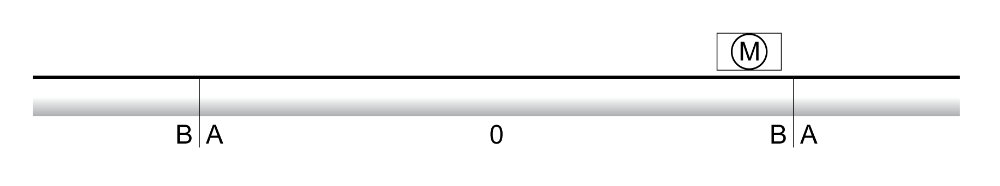

# Size of the Movement Range

## Description

The movement range is the maximum possible range within which a movement can be made to any position.

The actual position of the motor is the position in the movement range.

The figure below shows the movement range in user-defined units with the factory scaling.

**A** -2147483648 user-defined units (usr\_p)

**B** 2147483647 user-defined units (usr\_p)

## Availability

The movement range is relevant in the following operating modes:

* Jog
* Homing
* Cyclic Synchronous Position

## Zero Point of the Movement Range

The zero point of the movement range is the point of reference for absolute movements.

## Valid Zero Point

The zero point of the movement range is set by means of a reference movement or by position setting.

A reference movement and position setting can be performed in the operating mode Homing.

In the case of a movement beyond the movement range (for example, a relative movement), the zero point becomes invalid.

0198441114060.03

© 2021

Schneider Electric.

All rights reserved.