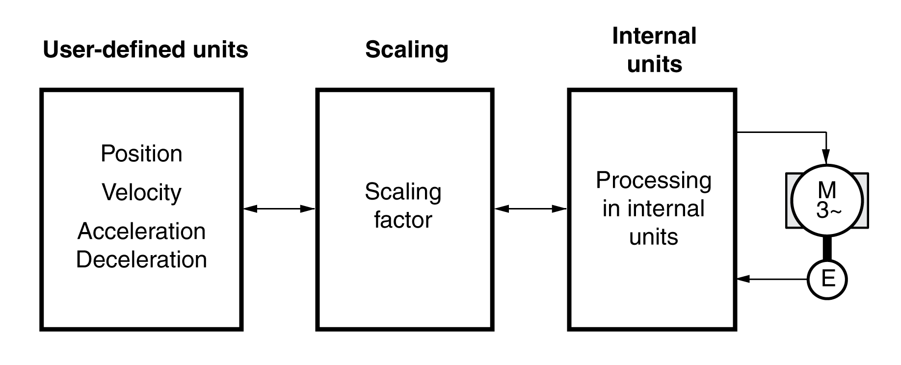

# General

## Overview

Scaling converts user-defined units into internal units of the device, and vice versa.

## User-Defined Units

Values for positions, velocities, acceleration and deceleration are specified in the following user-defined unit:

* usr\_p for positions
* usr\_v for velocities
* usr\_a for acceleration and deceleration

Modifying the scaling modifies the ratio between user-defined units and internal units. After a modification to the scaling, the same value of a parameter specified in a user-defined unit causes a different movement than before the modification. A modification of the scaling affects all parameters whose values are specified in user-defined units.

| WARNING | |
| --- | --- |
|  | UNINTENDED MOVEMENT  * Verify all parameters with user-defined units before modifying the scaling factor. * Verify that a modification of the scaling factor cannot cause unintended movements.  Failure to follow these instructions can result in death, serious injury, or equipment damage. |

## Scaling Factor

The scaling factor is the relationship between the motor movement and the required user-defined units.

0198441114060.03

© 2021

Schneider Electric.

All rights reserved.