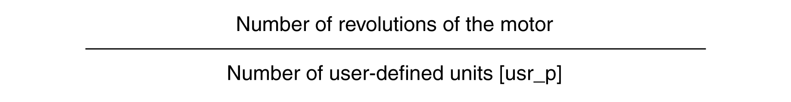

# Configuration of Position Scaling

## Description

Position scaling is the relationship between the number of motor revolutions and the required user-defined units (usr\_p).

## Scaling Factor

Position scaling is specified by means of scaling factor:

In the case of a rotary motor, the scaling factor is calculated as shown below:

The scaling factor is set to 1 / 131072 by the logic/motion controller.

0198441114060.03

© 2021

Schneider Electric.

All rights reserved.