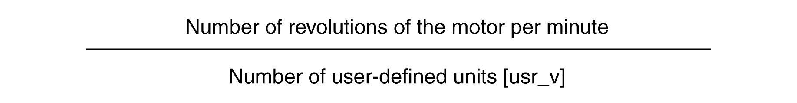

# Configuration of Velocity Scaling

## Description

Velocity scaling is the relationship between the number of motor revolutions per minute and the required user-defined units (usr\_v).

## Scaling Factor

Velocity scaling is specified by means of scaling factor:

In the case of a rotary motor, the scaling factor is calculated as shown below:

## Factory Setting

The following factory settings are used:

1 motor revolution per minute corresponds to 1 user-defined unit

| Parameter name  HMI menu  HMI name | Description | Unit  Minimum value  Factory setting  Maximum value | Data type  R/W  Persistent  Expert | Parameter address via fieldbus |
| --- | --- | --- | --- | --- |
| ScaleVELnum | Velocity scaling: Numerator.  Specification of the scaling factor:  Speed of rotation of motor [RPM]  --------------------------------------------------  User-defined units [usr\_v]  A new scaling is activated when the numerator value is supplied.  Type: Signed decimal - 4 bytes  Write access via Sercos: CP2, CP3, CP4  Setting can only be modified if power stage is disabled.  Modified settings become active immediately. | RPM  1  1  2147483647 | INT32  R/W  per.  - | Modbus 1604  IDN P-0-3006.0.34 |
| ScaleVELdenom | Velocity scaling: Denominator.  See numerator (ScaleVELnum) for a description.  A new scaling is activated when the numerator value is supplied.  Type: Signed decimal - 4 bytes  Write access via Sercos: CP2, CP3, CP4  Setting can only be modified if power stage is disabled. | usr\_v  1  1  2147483647 | INT32  R/W  per.  - | Modbus 1602  IDN P-0-3006.0.33 |

0198441114060.03

© 2021

Schneider Electric.

All rights reserved.