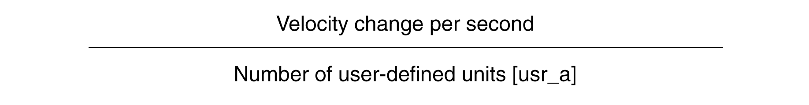

# Configuration of Ramp Scaling

## Description

Ramp scaling is the relationship between the change in velocity and the required user-defined units (usr\_a).

## Scaling Factor

Ramp scaling is specified by means of scaling factor:

## Factory Setting

The following factory settings are used:

A change of 1 motor revolution per minute per second corresponds to 1 user-defined unit.

| Parameter name  HMI menu  HMI name | Description | Unit  Minimum value  Factory setting  Maximum value | Data type  R/W  Persistent  Expert | Parameter address via fieldbus |
| --- | --- | --- | --- | --- |
| ScaleRAMPnum | Ramp scaling: Numerator.  Type: Signed decimal - 4 bytes  Write access via Sercos: CP2, CP3, CP4  Setting can only be modified if power stage is disabled.  Modified settings become active immediately. | RPM/s  1  1  2147483647 | INT32  R/W  per.  - | Modbus 1634  IDN P-0-3006.0.49 |
| ScaleRAMPdenom | Ramp scaling: Denominator.  See numerator (ScaleRAMPnum) for a description.  A new scaling is activated when the numerator value is supplied.  Type: Signed decimal - 4 bytes  Write access via Sercos: CP2, CP3, CP4  Setting can only be modified if power stage is disabled. | usr\_a  1  1  2147483647 | INT32  R/W  per.  - | Modbus 1632  IDN P-0-3006.0.48 |

0198441114060.03

© 2021

Schneider Electric.

All rights reserved.