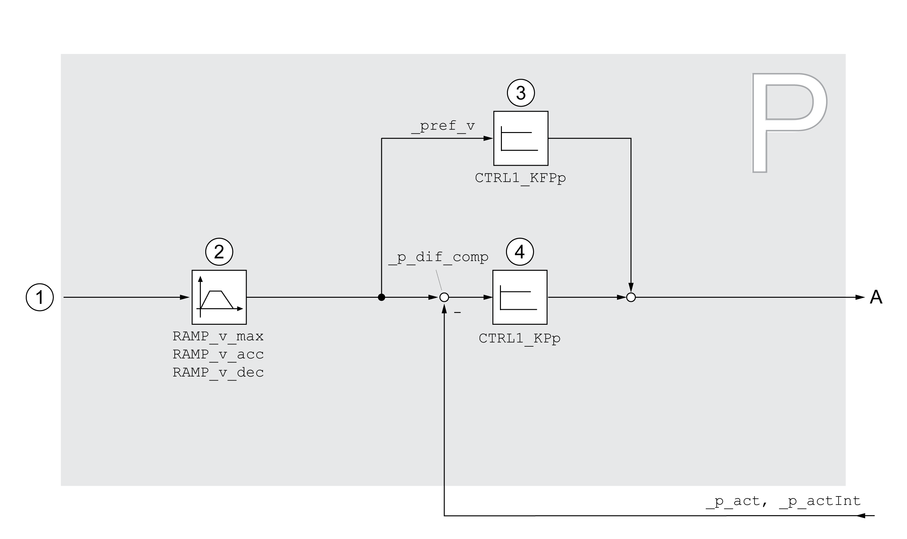

# Overview of Position Controller

## Overview

The illustration below provides an overview of the position controller.

**1** Target values for the operating modes Jog and Homing

**2** Motion profile for the velocity

**3** Velocity feed-forward control

**4** Position controller

## Sampling Period

The sampling period of the position controller is 250 µs.

0198441114060.03

© 2021

Schneider Electric.

All rights reserved.