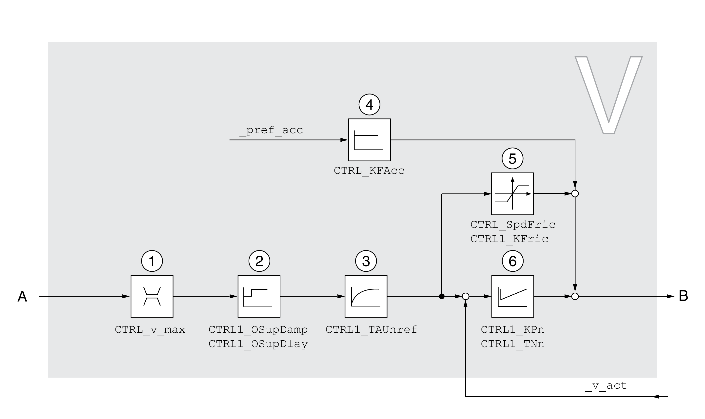

# Overview of Velocity Controller

## Overview

The illustration below provides an overview of the velocity controller.

**1** Velocity limitation

**2** Overshoot suppression filter (parameter accessible in Expert mode)

**3** Filter time constant of the reference velocity value filter

**4** Acceleration feed forward control (parameter accessible in Expert mode)

**5** Friction compensation (parameter accessible in Expert mode)

**6** Velocity Loop Controller

## Sampling Period

The sampling period of the velocity controller is 62.5 µs.

0198441114060.03

© 2021

Schneider Electric.

All rights reserved.