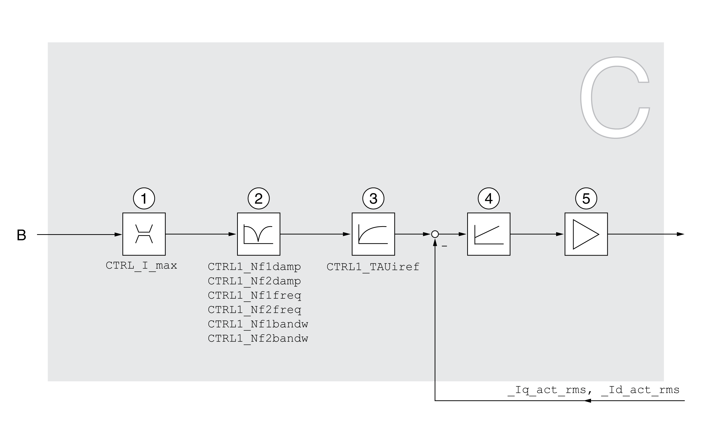

# Overview of Current Controller

## Overview

The illustration below provides an overview of the current controller.

**1** Current limitation

**2** Notch filter (parameter accessible in Expert mode)

**3** Filter time constant of the reference current value filter

**4** Current controller

**5** Power stage

## Sampling Period

The sampling period of the current controller is 62.5 µs.

0198441114060.03

© 2021

Schneider Electric.

All rights reserved.