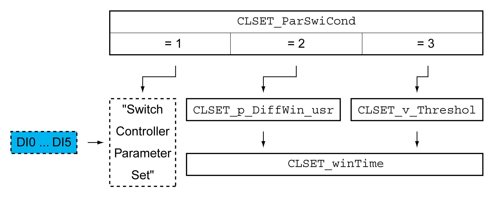
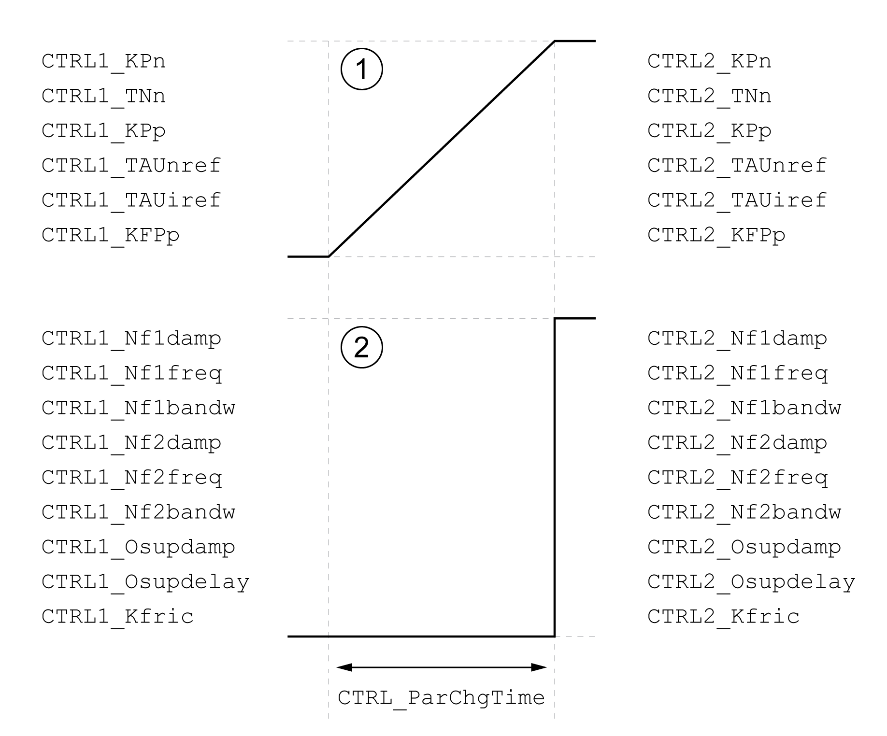

# Automatically Switching Between Control Loop Parameter Sets

## Description

It is possible to automatically switch between the two control loop parameter sets.

The following criteria can be set for switching between the control loop parameter sets:

* Digital signal input
* Position deviation window
* Target velocity below parameterizable value
* Actual velocity below parameterizable value

## Settings

The illustration below provides an overview of switching between the parameter sets.

## Time Chart

The freely accessible parameters are changed linearly. This linear change of the values of control loop parameter set 1 to the values of control loop parameter set 2 takes place during the parameterizable time CTRL\_ParChgTime.

The parameters only accessible in Expert mode are directly changed to the values of the other control loop parameter set after the parameterizable time CTRL\_ParChgTime has passed.

The figure below shows the time chart for switching the control loop parameters.

Time chart for switching the control loop parameter sets

**1** Freely accessible parameters are changed linearly over time

**2** Parameters which are only accessible in Expert mode are switched over directly

| Parameter name  HMI menu  HMI name | Description | Unit  Minimum value  Factory setting  Maximum value | Data type  R/W  Persistent  Expert | Parameter address via fieldbus |
| --- | --- | --- | --- | --- |
| CLSET\_ParSwiCond | Condition for parameter set switching.  **0 / None Or Digital Input**: None or digital input function selected  **1 / Inside Position Deviation**: Inside position deviation (value definition in parameter CLSET\_p\_DiffWin)  **2 / Below Reference Velocity**: Below reference velocity (value definition in parameter CLSET\_v\_Threshol)  **3 / Below Actual Velocity**: Below actual velocity (value definition in parameter CLSET\_v\_Threshol)  **4 / Reserved**: Reserved  In the case of parameter set switching, the values of the following parameters are changed gradually:  - CTRL\_KPn  - CTRL\_TNn  - CTRL\_KPp  - CTRL\_TAUnref  - CTRL\_TAUiref  - CTRL\_KFPp  The following parameters are changed immediately after the time for parameter set switching (CTRL\_ParChgTime):  - CTRL\_Nf1damp  - CTRL\_Nf1freq  - CTRL\_Nf1bandw  - CTRL\_Nf2damp  - CTRL\_Nf2freq  - CTRL\_Nf2bandw  - CTRL\_Osupdamp  - CTRL\_Osupdelay  - CTRL\_Kfric  Type: Unsigned decimal - 2 bytes  Write access via Sercos: CP2, CP3, CP4  Modified settings become active immediately. | -  0  0  4 | UINT16  R/W  per.  - | Modbus 4404  IDN P-0-3017.0.26 |
| CLSET\_p\_DiffWin\_usr | Position deviation for control loop parameter set switching.  If the position deviation of the position controller is less than the value of this parameter, control loop parameter set 2 is used. Otherwise, control loop parameter set 1 is used.  The minimum value, the factory setting and the maximum value depend on the scaling factor.  Type: Signed decimal - 4 bytes  Write access via Sercos: CP2, CP3, CP4  Modified settings become active immediately. | usr\_p  0  1311  2147483647 | INT32  R/W  per.  - | Modbus 4426  IDN P-0-3017.0.37 |
| CLSET\_v\_Threshol | Velocity threshold for control loop parameter set switching.  If the reference velocity or the actual velocity are less than the value of this parameter, control loop parameter set 2 is used. Otherwise, control loop parameter set 1 is used.  Type: Unsigned decimal - 4 bytes  Write access via Sercos: CP2, CP3, CP4  Modified settings become active immediately. | usr\_v  0  50  2147483647 | UINT32  R/W  per.  - | Modbus 4410  IDN P-0-3017.0.29 |
| CLSET\_winTime | Time window for parameter set switching.  Value 0: Window monitoring deactivated.  Value >0: Window time for the parameters CLSET\_v\_Threshol and CLSET\_p\_DiffWin.  Type: Unsigned decimal - 2 bytes  Write access via Sercos: CP2, CP3, CP4  Modified settings become active immediately. | ms  0  0  1000 | UINT16  R/W  per.  - | Modbus 4406  IDN P-0-3017.0.27 |
| CTRL\_ParChgTime | Period of time for control loop parameter set switching.  In the case of control loop parameter set switching, the values of the following parameters are changed linearly:  - CTRL\_KPn  - CTRL\_TNn  - CTRL\_KPp  - CTRL\_TAUnref  - CTRL\_TAUiref  - CTRL\_KFPp  Type: Unsigned decimal - 2 bytes  Write access via Sercos: CP2, CP3, CP4  Modified settings become active immediately. | ms  0  0  2000 | UINT16  R/W  per.  - | Modbus 4392  IDN P-0-3017.0.20 |

0198441114060.03

© 2021

Schneider Electric.

All rights reserved.