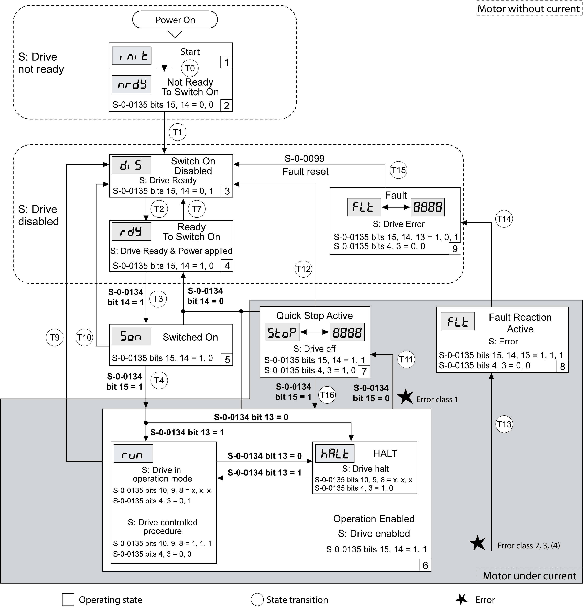

# State Diagram and State Transitions

## State Diagram

When the product is powered on and when an operating mode is started, the product goes through a number of operating states.

The state diagram (state machine) shows the relationships between the operating states and the state transitions.

The operating states are internally monitored and influenced by monitoring functions.

## Operating States

| Operating state | Description |
| --- | --- |
| **1** Start | Electronics are initialized |
| **2** Not Ready To Switch On | The power stage is not ready to switch on |
| **3** Switch On Disabled | Impossible to enable the power stage |
| **4** Ready To Switch On | The power stage is ready to switch on. |
| **5** Switched On | Power stage is switched on |
| **6** Operation Enabled | Power stage is enabled  Selected operating mode is active |
| **7** Quick Stop Active | "Quick Stop" is being executed |
| **8** Fault Reaction Active | Error response is active |
| **9** Fault | Error response terminated  Power stage is disabled |

## Error Class

The errors are classified according to the following error classes:

| Error class | State transition | Error response | Resetting an error message |
| --- | --- | --- | --- |
| 0 | - | No interruption of the movement | Function "Fault Reset" |
| 1 | T11 | Stop movement with "Quick Stop" | Function "Fault Reset" |
| 2 | T13, T14 | Stop movement with "Quick Stop" and disable the power stage when the motor has come to a standstill | Function "Fault Reset" |
| 3 | T13, T14 | Disable the power stage immediately without stopping the movement first | Function "Fault Reset" |
| 4 | T13, T14 | Disable the power stage immediately without stopping the movement first | Power cycle |

## Error Response

The state transition T13 (error class 2, 3 or 4) initiates an error response as soon as an internal occurrence signals an error to which the device must react.

| Error class | Response |
| --- | --- |
| 2 | Movement is stopped with "Quick Stop"  Holding brake is applied  Power stage is disabled |
| 3, 4 or Safety function STO | Power stage is immediately disabled |

An error can be triggered by a temperature sensor, for example. The drive cancels the movement and triggers an error response. Subsequently, the operating state changes to **9** Fault.

## Resetting an Error Message

A "Fault Reset" resets an error message.

In the event of a "Quick Stop" triggered by a detected error of class 1 (operating state **7** Quick Stop Active), a "Fault Reset" causes a direct transition to operating state **6** Operation Enabled.

## State Transitions

State transitions are triggered by an input signal, a fieldbus command or as a response to a monitoring function.

| State transition | Operating state | Condition / event(1) | Response |
| --- | --- | --- | --- |
| T0 | **1**-> **2** | * Device electronics successfully initialized |  |
| T1 | **2**-> **3** | * Parameter successfully initialized |  |
| T2 | **3** -> **4** | * No undervoltage  and Encoder successfully checked  and Actual velocity: <1000 RPM  and STO signals = +24V |  |
| T3 | **4** -> **5** | * Request for enabling the power stage |  |
| T4 | **5** -> **6** | * Request for ‘Drive ON’ | Power stage is enabled.  User parameters are checked.  Holding brake is released (if available). |
| T7 | **4** -> **3** | * Undervoltage * STO signals = 0V * Actual velocity: >1000 RPM (for example by external driving force) | - |
| T9 | **6** -> **3** | * Request for disabling the power stage |  |
| T10 | **5** -> **3** | * Request for disabling the power stage |  |
| T11 | **6** -> **7** | * Error of error class 1 | Movement is canceled with "Quick Stop". |
| T12 | **7** -> **3** | * Request for disabling the power stage | Power stage is disabled immediately, even if "Quick Stop" is still active. |
| T13 | **x** -> **8** | * Error of error classes 2, 3 or 4 | Error response is carried out, see "Error Response". |
| T14 | **8** -> **9** | * Error response terminated (error class 2) * Error of error classes 3 or 4 |  |
| T15 | **9** -> **3** | * Function: "Fault Reset" | Error is reset (cause of error must have been corrected). |
| T16 | **7** -> **6** | * Function: "Fault Reset" | In the event of a "Quick Stop" triggered by a detected error of class 1, a "Fault Reset" causes a direct transition to the operating state **6** Operation Enabled. |
| **(1)** In order to trigger a state transition it is sufficient if one condition is met. | | | |

0198441114060.03

© 2021

Schneider Electric.

All rights reserved.