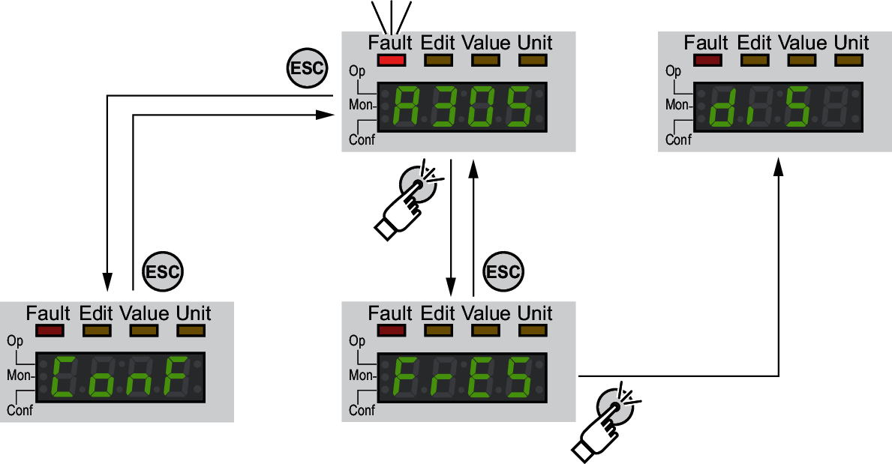

# Changing the Operating State via HMI

## Description

An error message can be reset via the HMI.

In the case of a detected error of error class 1, resetting the error message causes a transition from operating state **7** Quick Stop Active back to operating state **6** Operation Enabled.

In the case of a detected error of error classes 2 or 3, resetting the error message causes a transition from operating state **9** Fault back to operating state **3** Switch On Disabled.

0198441114060.03

© 2021

Schneider Electric.

All rights reserved.