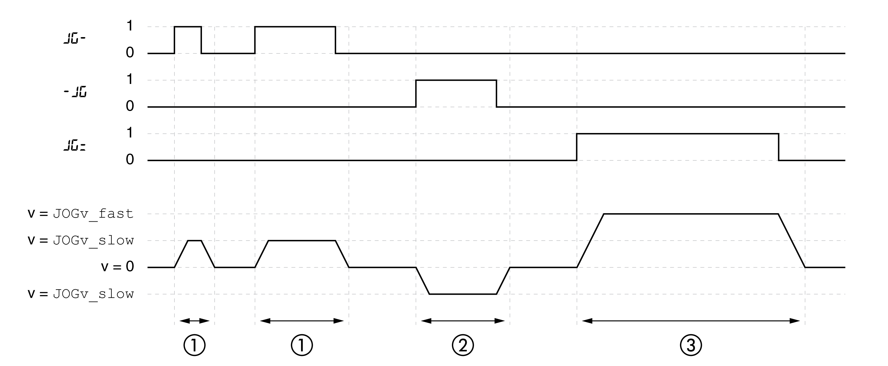
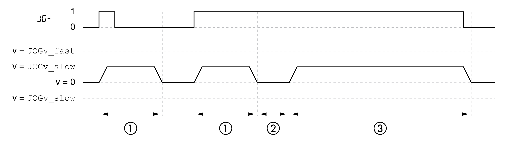

# Overview

## Description

In the operating mode Jog, a movement is made from the actual motor position in the specified direction.

A movement can be made using one of two methods:

* Continuous movement
* Step movement

In addition, the product features two parameterizable velocities.

Further, the movement can be made either in a positive or negative direction for both methods:

* **( **JG-**)** : slow movement in positive direction
* **( **JG=**)** : fast movement in positive direction
* **(**-JG** )** : slow movement in negative direction
* **(**=JG** )** : fast movement in negative direction

## Continuous Movement

As long as the signal for the direction is available, a continuous movement is made in the desired direction.

The illustration below provides an example of continuous movement:

**1** Slow movement in positive direction

**2** Slow movement in negative direction

**3** Fast movement in positive direction

## Step Movement

If the signal for the direction is available for a short period of time, a movement with a parameterizable number of user-defined units is made in the desired direction.

If the signal for the direction is available continuously, a movement with a parameterizable number of user-defined units is made in the desired direction. After this movement, the motor stops for a defined period of time. Then a continuous movement is made in the desired direction.

The illustration provides an example of step movement:

**1** Slow movement in positive direction with a parameterizable number of user-defined units JOGstep

**2** Waiting time JOGtime

**3** Slow continuous movement in positive direction

## Integrated HMI

It is also possible to start the operating mode via the HMI. Calling →**(**OP**)**→**(**jog-**)**→**(**JGST**)** enables the power stage and starts the operating mode.

The method Continuous Movement is controlled via the HMI.

Turn the navigation button to select one of 4 types of movement:

* **( **JG-**)** : slow movement in positive direction
* **( **JG=**)** : fast movement in positive direction
* **(**-JG** )** : slow movement in negative direction
* **(**=JG** )** : fast movement in negative direction

Press the navigation button to start the movement.

## Status Messages

Information on the operating state and the ongoing movement is available via signal outputs.

The table below provides an overview of the signal outputs:

| Signal output | Signal output function |
| --- | --- |
| DQ0 | "No Fault"  Signals the operating states **4** Ready To Switch On, **5** Switched On and **6** Operation Enabled |
| DQ1 | "Active"  Signals the operating state **6** Operation Enabled |
| DQ2 | "Freely Available"  See [Setting a Signal Output via Parameter](SettingASignalOutputViaParameter-C6A56547.html#SettingASignalOutputViaParameter-C6A56547) |

It is possible to change the factory settings of the signal outputs, see [Digital Signal Inputs and Digital Signal Outputs](DigitalSignalInputsAndDigitalSignal-C50B3C34.html#DigitalSignalInputsAndDigitalSignal-C50B3C34).

0198441114060.03

© 2021

Schneider Electric.

All rights reserved.