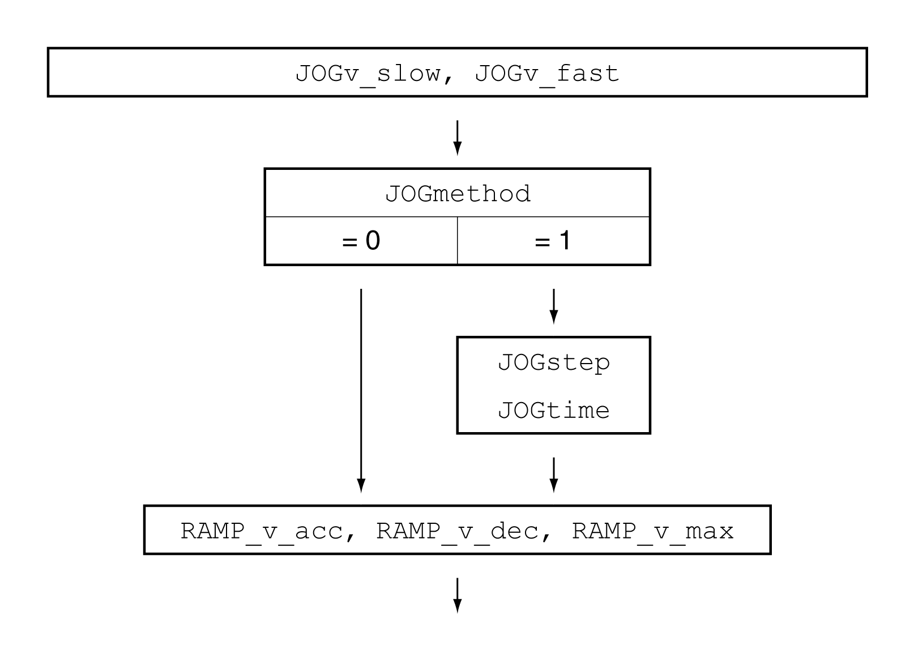

# Parameterization

## Overview

The illustration below provides an overview of the adjustable parameters.

## Velocities

Two parameterizable velocities are available.

Set the desired values with the parameters JOGv\_slow and JOGv\_fast.

| Parameter name  HMI menu  HMI name | Description | Unit  Minimum value  Factory setting  Maximum value | Data type  R/W  Persistent  Expert | Parameter address via fieldbus |
| --- | --- | --- | --- | --- |
| JOGv\_slow  ****(oP)**** → ****(JoG-)****  ****(JGLo)**** | Velocity for slow movement.  The adjustable value is internally limited to the parameter setting in RAMP\_v\_max.  Type: Unsigned decimal - 4 bytes  Write access via Sercos: CP2, CP3, CP4  Modified settings become active immediately. | usr\_v  1  60  2147483647 | UINT32  R/W  per.  - | Modbus 10504  IDN P-0-3041.0.4 |
| JOGv\_fast  ****(oP)**** → ****(JoG-)****  ****(JGhi)**** | Velocity for fast movement.  The adjustable value is internally limited to the parameter setting in RAMP\_v\_max.  Type: Unsigned decimal - 4 bytes  Write access via Sercos: CP2, CP3, CP4  Modified settings become active immediately. | usr\_v  1  180  2147483647 | UINT32  R/W  per.  - | Modbus 10506  IDN P-0-3041.0.5 |

## Selection of the Method

The parameter JOGmethod lets you set the method.

| Parameter name  HMI menu  HMI name | Description | Unit  Minimum value  Factory setting  Maximum value | Data type  R/W  Persistent  Expert | Parameter address via fieldbus |
| --- | --- | --- | --- | --- |
| JOGmethod | Selection of jog method.  **0 / Continuous Movement / **(coMo)****: Jog with continuous movement  **1 / Step Movement / **(StMo)****: Jog with step movement  Type: Unsigned decimal - 2 bytes  Write access via Sercos: CP2, CP3, CP4  Modified settings become active immediately. | -  0  1  1 | UINT16  R/W  -  - | Modbus 10502  IDN P-0-3041.0.3 |

## Setting the Step Movement

The parameters JOGstep and JOGtime are used to set the parameterizable number of user-defined units and the time for which the motor is stopped.

| Parameter name  HMI menu  HMI name | Description | Unit  Minimum value  Factory setting  Maximum value | Data type  R/W  Persistent  Expert | Parameter address via fieldbus |
| --- | --- | --- | --- | --- |
| JOGstep | Distance for step movement.  Type: Signed decimal - 4 bytes  Write access via Sercos: CP2, CP3, CP4  Modified settings become active the next time the motor moves. | usr\_p  1  20  2147483647 | INT32  R/W  per.  - | Modbus 10510  IDN P-0-3041.0.7 |
| JOGtime | Wait time for step movement.  Type: Unsigned decimal - 2 bytes  Write access via Sercos: CP2, CP3, CP4  Modified settings become active the next time the motor moves. | ms  1  500  32767 | UINT16  R/W  per.  - | Modbus 10512  IDN P-0-3041.0.8 |

## Changing the Motion Profile for the Velocity

It is possible to change the parameterization of the [Motion Profile for the Velocity](MotionProfileForTheVelocity-C69446A0.html#MotionProfileForTheVelocity-C69446A0).

0198441114060.03

© 2021

Schneider Electric.

All rights reserved.