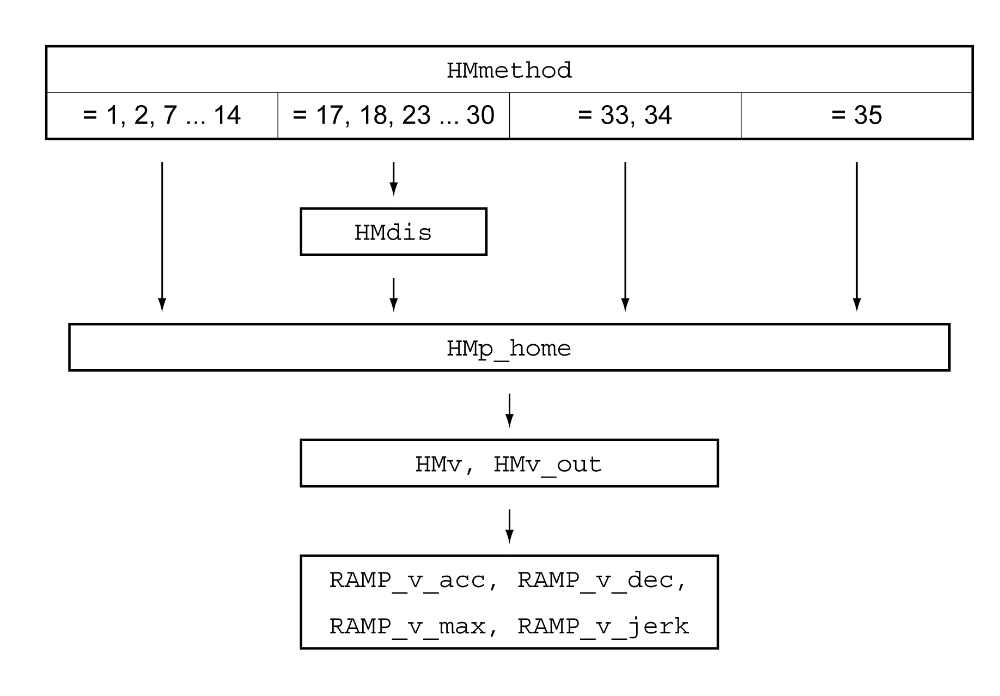

# Parameterization

## Overview

The illustration below provides an overview of the adjustable parameters.

## Setting Limit Switches and Reference Switches

The limit switches and reference switches must be set to meet the requirements, see [Limit Switches](LimitSwitches-C716982F.html#LimitSwitches-C716982F) and [Reference Switch](ReferenceSwitch-C7172C7D.html#ReferenceSwitch-C7172C7D).

## Selection of the Method

The operating mode Homing establishes an absolute position reference between the motor position and a defined axis position. There are various Homing methods which can be selected via the parameter HMmethod.

The HMprefmethod parameter is used to save the preferred method to the nonvolatile memory (persistent). When the preferred method has been set in this parameter, the method is performed during homing even after the device is powered off and on. The value to be entered corresponds to the value in the HMmethod parameter.

| Parameter name  HMI menu  HMI name | Description | Unit  Minimum value  Factory setting  Maximum value | Data type  R/W  Persistent  Expert | Parameter address via fieldbus |
| --- | --- | --- | --- | --- |
| HMmethod | Homing method.  1: LIMN with index pulse  2: LIMP with index pulse  7: REF+ with index pulse, inv., outside  8: REF+ with index pulse, inv., inside  9: REF+ with index pulse, not inv., inside  10: REF+ with index pulse, not inv., outside  11: REF- with index pulse, inv., outside  12: REF- with index pulse, inv., inside  13: REF- with index pulse, not inv., inside  14: REF- with index pulse, not inv., outside  17: LIMN  18: LIMP  23: REF+, inv., outside  24: REF+, inv., inside  25: REF+, not inv., inside  26: REF+, not inv., outside  27: REF-, inv., outside  28: REF-, inv., inside  29: REF-, not inv., inside  30: REF-, not inv., outside  33: Index pulse negative direction  34: Index pulse positive direction  35: Position setting  Abbreviations:  REF+: Search movement in positive direction  REF-: Search movement in negative direction  inv.: Invert direction in switch  not inv.: Direction not inverted in switch  outside: Index pulse / distance outside switch  inside: Index pulse / distance inside switch  Type: Signed decimal - 2 bytes  Write access via Sercos: CP2, CP3, CP4  Modified settings become active immediately. | -  1  18  35 | INT16  R/W  -  - | Modbus 6936  IDN P-0-3027.0.12 |
| HMprefmethod  ****(oP)**** → ****(hoM-)****  ****(MEth)**** | Preferred homing method.  Type: Signed decimal - 2 bytes  Write access via Sercos: CP2, CP3, CP4  Modified settings become active immediately. | -  1  18  35 | INT16  R/W  per.  - | Modbus 10260  IDN P-0-3040.0.10 |

## Setting the Distance From the Switching Point

A distance to the switching point of the limit switch or the reference switch must be parameterized for a reference movement with index pulse. The parameter HMdis lets you set the distance to the switching limit switch or the reference switch.

| Parameter name  HMI menu  HMI name | Description | Unit  Minimum value  Factory setting  Maximum value | Data type  R/W  Persistent  Expert | Parameter address via fieldbus |
| --- | --- | --- | --- | --- |
| HMdis | Distance from switching point.  The distance from the switching point is defined as the reference point.  The parameter is only effective during a reference movement without index pulse.  Type: Signed decimal - 4 bytes  Write access via Sercos: CP2, CP3, CP4  Modified settings become active the next time the motor moves. | usr\_p  1  200  2147483647 | INT32  R/W  per.  - | Modbus 10254  IDN P-0-3040.0.7 |

## Defining the Zero Point

The parameter HMp\_home is used to specify a desired position value, which is set at the reference point after a successful reference movement. The desired position value at the reference point defines the zero point.

If the value 0 is used, the zero point corresponds to the reference point.

| Parameter name  HMI menu  HMI name | Description | Unit  Minimum value  Factory setting  Maximum value | Data type  R/W  Persistent  Expert | Parameter address via fieldbus |
| --- | --- | --- | --- | --- |
| HMp\_home | Position at reference point.  After a successful reference movement, this position is automatically set at the reference point.  Type: Signed decimal - 4 bytes  Write access via Sercos: CP2, CP3, CP4  Modified settings become active the next time the motor moves. | usr\_p  -2147483648  0  2147483647 | INT32  R/W  per.  - | Modbus 10262  IDN P-0-3040.0.11 |

## Setting Monitoring

The parameters HMoutdis and HMsrchdis allow you to activate monitoring of the limit switches and the reference switch.

| Parameter name  HMI menu  HMI name | Description | Unit  Minimum value  Factory setting  Maximum value | Data type  R/W  Persistent  Expert | Parameter address via fieldbus |
| --- | --- | --- | --- | --- |
| HMoutdis | Maximum distance for search for switching point.  0: Monitoring of distance inactive  >0: Maximum distance  After detection of the switch, the drive starts to search for the defined switching point. If the defined switching point is not found within the distance defined here, the reference movement is canceled and an error is detected.  Type: Signed decimal - 4 bytes  Write access via Sercos: CP2, CP3, CP4  Modified settings become active the next time the motor moves. | usr\_p  0  0  2147483647 | INT32  R/W  per.  - | Modbus 10252  IDN P-0-3040.0.6 |
| HMsrchdis | Maximum search distance after overtravel of switch.  0: Search distance monitoring disabled  >0: Search distance  The switch must be activated again within this search distance, otherwise the reference movement is canceled.  Type: Signed decimal - 4 bytes  Write access via Sercos: CP2, CP3, CP4  Modified settings become active the next time the motor moves. | usr\_p  0  0  2147483647 | INT32  R/W  per.  - | Modbus 10266  IDN P-0-3040.0.13 |

## Reading out the Position Distance

The position distance between the switching point and index pulse can be read out with the following parameter.

The distance between the switching point and the index pulse must be >0.05 revolutions for reproducible reference movements with index pulse.

If the index pulse is too close to the switching point, the limit switch or reference switch can be moved mechanically.

Otherwise the position of the index pulse can be moved with the parameter ENC\_pabsusr, see [Setting Parameters for Encoder](SettingParametersForEncoder-C423C708.html#SettingParametersForEncoder-C423C708).

| Parameter name  HMI menu  HMI name | Description | Unit  Minimum value  Factory setting  Maximum value | Data type  R/W  Persistent  Expert | Parameter address via fieldbus |
| --- | --- | --- | --- | --- |
| \_HMdisREFtoIDX\_usr | Distance from switching point to index pulse.  Allows you to verify the distance between the index pulse and the switching point and serves as a criterion for determining whether the reference movement with index pulse can be reproduced.  Type: Signed decimal - 4 bytes | usr\_p  -2147483648  -  2147483647 | INT32  R/-  -  - | Modbus 10270  IDN P-0-3040.0.15 |

## Setting Velocities

The parameters HMv and HMv\_out are used to set the velocities for searching the switch and for moving away from the switch.

| Parameter name  HMI menu  HMI name | Description | Unit  Minimum value  Factory setting  Maximum value | Data type  R/W  Persistent  Expert | Parameter address via fieldbus |
| --- | --- | --- | --- | --- |
| HMv  ****(oP)**** → ****(hoM-)****  ****( hMn)**** | Target velocity for searching the switch.  The adjustable value is internally limited to the parameter setting in RAMP\_v\_max.  Type: Unsigned decimal - 4 bytes  Write access via Sercos: CP2, CP3, CP4  Modified settings become active the next time the motor moves. | usr\_v  -  60  - | UINT32  R/W  per.  - | Modbus 10248  IDN P-0-3040.0.4 |
| HMv\_out | Target velocity for moving away from switch.  The adjustable value is internally limited to the parameter setting in RAMP\_v\_max.  Type: Unsigned decimal - 4 bytes  Write access via Sercos: CP2, CP3, CP4  Modified settings become active the next time the motor moves. | usr\_v  1  6  2147483647 | UINT32  R/W  per.  - | Modbus 10250  IDN P-0-3040.0.5 |

## Changing the Motion Profile for the Velocity

It is possible to change the parameterization of the [Motion Profile for the Velocity](MotionProfileForTheVelocity-C69446A0.html#MotionProfileForTheVelocity-C69446A0).

0198441114060.03

© 2021

Schneider Electric.

All rights reserved.