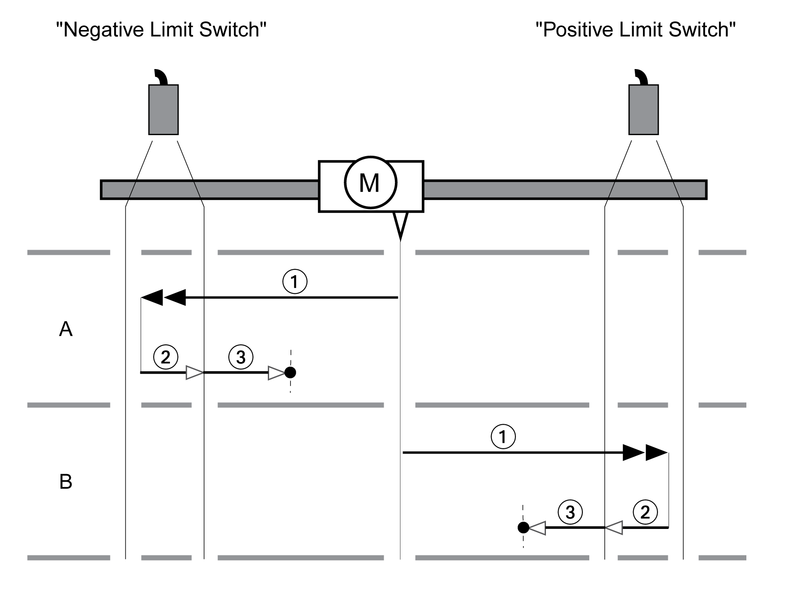

# Reference Movement to a Limit Switch

## Overview

The illustration below shows a reference movement to a limit switch

**1** Movement to limit switch at velocity HMv

**2** Movement to the switching point of the limit switch at velocity HMv\_out

**3** Movement to index pulse or movement to a distance from the switching point at velocity HMv\_out

## Type A

Method 1: Movement to the index pulse.

Method 17: Movement to distance from switching point.

## Type B

Method 2: Movement to the index pulse.

Method 18: Movement to distance from switching point.

0198441114060.03

© 2021

Schneider Electric.

All rights reserved.