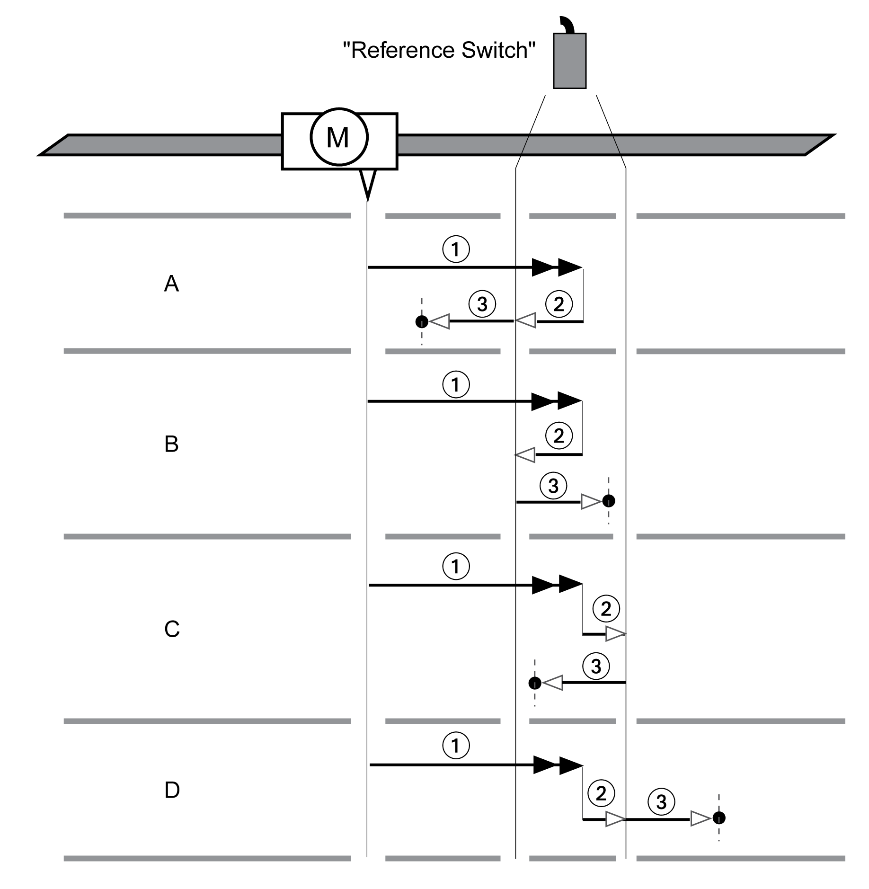

# Reference Movement to the Reference Switch in Positive Direction

## Overview

The illustration below shows a reference movement to the reference switch in positive direction

**1** Movement to reference switch at velocity HMv

**2** Movement to the switching point of the reference switch at velocity HMv\_out

**3** Movement to index pulse or movement to a distance from the switching point at velocity HMv\_out

## Type A

Method 7: Movement to the index pulse.

Method 23: Movement to distance from switching point.

## Type B

Method 8: Movement to the index pulse.

Method 24: Movement to distance from switching point.

## Type C

Method 9: Movement to the index pulse.

Method 25: Movement to distance from switching point.

## Type D

Method 10: Movement to the index pulse.

Method 26: Movement to distance from switching point.

0198441114060.03

© 2021

Schneider Electric.

All rights reserved.