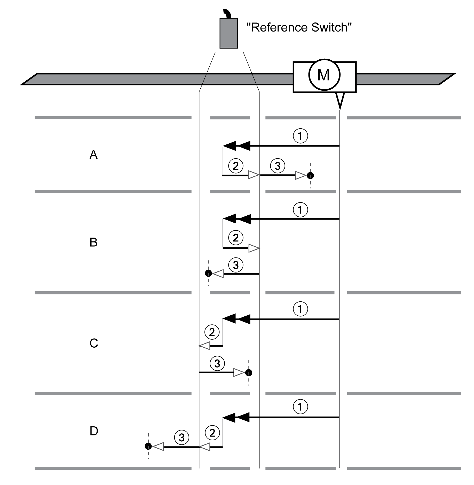

# Reference Movement to the Reference Switch in Negative Direction

## Overview

The illustration below shows a reference movement to the reference switch in negative direction

**1** Movement to reference switch at velocity HMv

**2** Movement to the switching point of the reference switch at velocity HMv\_out

**3** Movement to index pulse or movement to a distance from the switching point at velocity HMv\_out

## Type A

Method 11: Movement to the index pulse.

Method 27: Movement to distance from switching point.

## Type B

Method 12: Movement to the index pulse.

Method 28: Movement to distance from switching point.

## Type C

Method 13: Movement to the index pulse.

Method 29: Movement to distance from switching point.

## Type D

Method 14: Movement to the index pulse.

Method 30: Movement to distance from switching point.

0198441114060.03

© 2021

Schneider Electric.

All rights reserved.