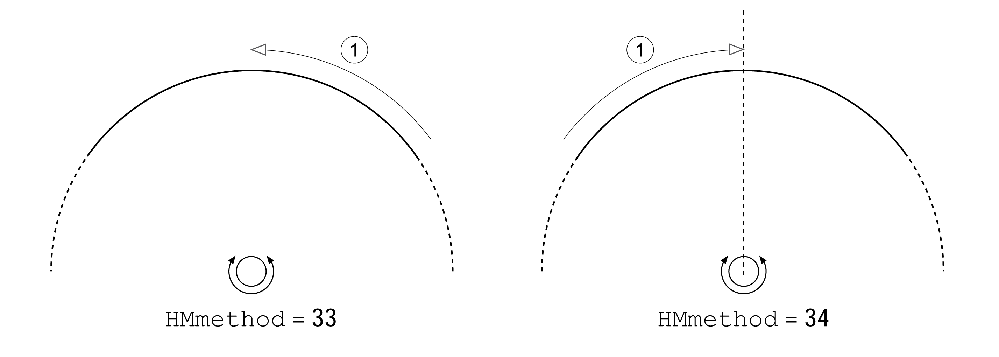

# Reference Movement to the Index Pulse

## Overview

The illustration below shows a reference movement to the index pulse

**1** Movement to index pulse at velocity HMv\_out

0198441114060.03

© 2021

Schneider Electric.

All rights reserved.