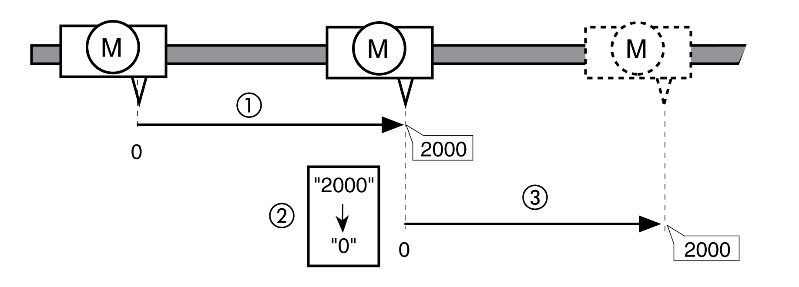

# Position Setting

## Description

By means of position setting, the actual position of the motor is set to the position value in parameter HMp\_home. This also defines the zero point.

Position setting is only possible when the motor is at a standstill. Any active position deviation remains active and can still be compensated for by the position controller after position setting.

## Setting the Position for Position Setting

| Parameter name  HMI menu  HMI name | Description | Unit  Minimum value  Factory setting  Maximum value | Data type  R/W  Persistent  Expert | Parameter address via fieldbus |
| --- | --- | --- | --- | --- |
| HMp\_home | Position at reference point.  After a successful reference movement, this position is automatically set at the reference point.  Type: Signed decimal - 4 bytes  Write access via Sercos: CP2, CP3, CP4  Modified settings become active the next time the motor moves. | usr\_p  -2147483648  0  2147483647 | INT32  R/W  per.  - | Modbus 10262  IDN P-0-3040.0.11 |

## Example

Movement by 4000 user-defined units with position setting

**1** The motor is positioned by 2000 user-defined units.

**2** By means of position setting to 0, the actual position of the motor is set to position value 0 which, at the same time, defines a new zero point.

**3** When a new movement by 2000 user-defined units is triggered, the new target position is 2000 user-defined units.

0198441114060.03

© 2021

Schneider Electric.

All rights reserved.