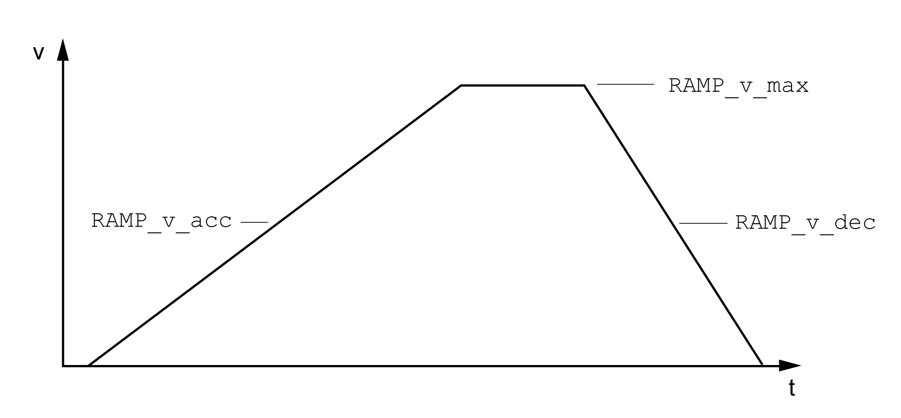

# Motion Profile for the Velocity

## Description

Target position and target velocity are input values specified by the user. A motion profile for the velocity is calculated on the basis of these input values.

The motion profile for the velocity consists of an acceleration, a deceleration and a maximum velocity.

A linear ramp for both directions of movement is available.

## Availability

The availability of the motion profile for the velocity depends on the operating mode.

In the following operating modes, the motion profile for the velocity is permanently active:

* Jog
* Homing

## Ramp Slope

The ramp slope determines the velocity changes of the motor per time unit. The ramp slope can be set for acceleration and deceleration.

| Parameter name  HMI menu  HMI name | Description | Unit  Minimum value  Factory setting  Maximum value | Data type  R/W  Persistent  Expert | Parameter address via fieldbus |
| --- | --- | --- | --- | --- |
| RAMP\_v\_enable | Activation of the motion profile for velocity.  **0 / Profile Off**: Profile off  **1 / Profile On**: Profile on  Type: Unsigned decimal - 2 bytes  Write access via Sercos: CP2, CP3, CP4  Setting can only be modified if power stage is disabled.  Modified settings become active immediately. | -  0  1  1 | UINT16  R/W  per.  - | Modbus 1622  IDN P-0-3006.0.43 |
| RAMP\_v\_max  ****(ConF)**** → ****(ACG-)****  ****(nrMP)**** | Maximum velocity of the motion profile for velocity.  If a greater reference velocity is set in one of these operating modes, it is automatically limited to RAMP\_v\_max.  This way, commissioning at limited velocity is easier to perform.  Type: Unsigned decimal - 4 bytes  Write access via Sercos: CP2, CP3, CP4  Setting can only be modified if power stage is disabled.  Modified settings become active the next time the motor moves. | usr\_v  1  13200  2147483647 | UINT32  R/W  per.  - | Modbus 1554  IDN P-0-3006.0.9 |
| RAMP\_v\_acc | Acceleration of the motion profile for velocity.  Writing the value 0 has no effect on the parameter.  Type: Unsigned decimal - 4 bytes  Write access via Sercos: CP2, CP3, CP4  Modified settings become active the next time the motor moves. | usr\_a  1  600  2147483647 | UINT32  R/W  per.  - | Modbus 1556  IDN P-0-3006.0.10 |
| RAMP\_v\_dec | Deceleration of the motion profile for velocity.  The minimum value depends on the operating mode:  Operating modes with minimum value 120:  Jog  Homing  Writing the value 0 has no effect on the parameter.  Type: Unsigned decimal - 4 bytes  Write access via Sercos: CP2, CP3, CP4  Modified settings become active the next time the motor moves. | usr\_a  1  600  2147483647 | UINT32  R/W  per.  - | Modbus 1558  IDN P-0-3006.0.11 |

0198441114060.03

© 2021

Schneider Electric.

All rights reserved.