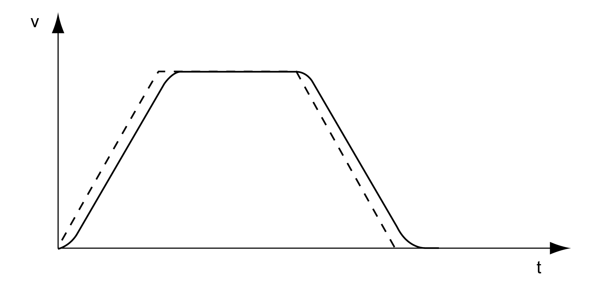

# Jerk Limitation

## Description

Jerk limitation smoothes sudden acceleration changes to allow for smooth transitions with almost no jerking.

## Availability

Jerk limitation is available in the following operating modes.

* Jog
* Homing

## Settings

Jerk limitation is activated and set via the parameter RAMP\_v\_jerk.

| Parameter name  HMI menu  HMI name | Description | Unit  Minimum value  Factory setting  Maximum value | Data type  R/W  Persistent  Expert | Parameter address via fieldbus |
| --- | --- | --- | --- | --- |
| RAMP\_v\_jerk  ****(ConF)**** → ****(drC-)****  ****( JEr)**** | Jerk limitation of the motion profile for velocity.  **0 / Off / **( oFF)****: Off  **1 / 1 / **( 1)****: 1 ms  **2 / 2 / **( 2)****: 2 ms  **4 / 4 / **( 4)****: 4 ms  **8 / 8 / **( 8)****: 8 ms  **16 / 16 / **( 16)****: 16 ms  **32 / 32 / **( 32)****: 32 ms  **64 / 64 / **( 64)****: 64 ms  **128 / 128 / **( 128)****: 128 ms  Adjustments can only be made if the operating mode is inactive (x\_end=1).  Type: Unsigned decimal - 2 bytes  Write access via Sercos: CP2, CP3, CP4  Modified settings become active the next time the motor moves. | ms  0  0  128 | UINT16  R/W  per.  - | Modbus 1562  IDN P-0-3006.0.13 |

0198441114060.03

© 2021

Schneider Electric.

All rights reserved.