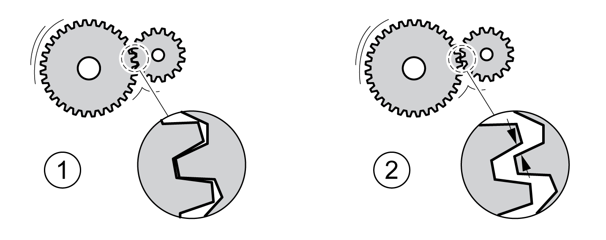

# Backlash Compensation

## Description

By setting backlash compensation, you can compensate for mechanical backlash.

Example of mechanical backlash

**1** Example of low mechanical backlash

**2** Example of high mechanical backlash

When backlash compensation is activated, the drive automatically compensates for the mechanical backlash during each movement.

## Availability

Backlash compensation is possible in the following operating modes:

* Jog
* Homing
* Cyclic Synchronous Position

## Parameterization

To use backlash compensation, you must set the amount of backlash.

The parameter BLSH\_Position lets you set the amount of backlash in user-defined units.

| Parameter name  HMI menu  HMI name | Description | Unit  Minimum value  Factory setting  Maximum value | Data type  R/W  Persistent  Expert | Parameter address via fieldbus |
| --- | --- | --- | --- | --- |
| BLSH\_Position | Position value for backlash compensation.  Type: Signed decimal - 4 bytes  Write access via Sercos: CP2, CP3, CP4  Setting can only be modified if power stage is disabled.  Modified settings become active the next time the power stage is enabled. | usr\_p  0  0  2147483647 | INT32  R/W  per.  - | Modbus 1668  IDN P-0-3006.0.66 |

In addition, you can set a processing time. The processing time specifies the period of time during which the mechanical backlash is to be compensated for.

The parameter BLSH\_Time lets you set the processing time in ms.

| Parameter name  HMI menu  HMI name | Description | Unit  Minimum value  Factory setting  Maximum value | Data type  R/W  Persistent  Expert | Parameter address via fieldbus |
| --- | --- | --- | --- | --- |
| BLSH\_Time | Processing time for backlash compensation.  Value 0: Immediate backlash compensation  Value >0: Processing time for backlash compensation  Type: Unsigned decimal - 2 bytes  Write access via Sercos: CP2, CP3, CP4  Setting can only be modified if power stage is disabled.  Modified settings become active the next time the power stage is enabled. | ms  0  0  16383 | UINT16  R/W  per.  - | Modbus 1672  IDN P-0-3006.0.68 |

## Activating Backlash Compensation

Before you can activate backlash compensation, there must be a movement in positive or negative direction. Backlash compensation is activated with the parameter BLSH\_Mode.

* Start a movement in positive direction or in negative direction. This movement must last as long as it takes to move the mechanical system connected to the motor.
* If the movement was in positive direction (positive target values), activate backlash compensation with the value "OnAfterPositiveMovement".
* If the movement was in negative direction (negative target values), activate backlash compensation with the value "OnAfterNegativeMovement".

| Parameter name  HMI menu  HMI name | Description | Unit  Minimum value  Factory setting  Maximum value | Data type  R/W  Persistent  Expert | Parameter address via fieldbus |
| --- | --- | --- | --- | --- |
| BLSH\_Mode | Processing mode of backlash compensation.  **0 / Off**: Backlash compensation is off  **1 / OnAfterPositiveMovement**: Backlash compensation is on, last movement was in positive direction  **2 / OnAfterNegativeMovement**: Backlash compensation is on, last movement was in negative direction  Type: Unsigned decimal - 2 bytes  Write access via Sercos: CP2, CP3, CP4  Modified settings become active immediately. | -  0  0  2 | UINT16  R/W  per.  - | Modbus 1666  IDN P-0-3006.0.65 |

0198441114060.03

© 2021

Schneider Electric.

All rights reserved.