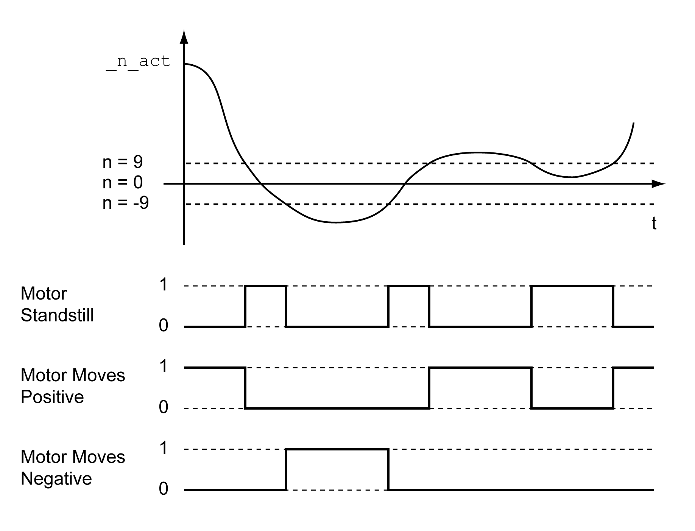

# Motor Standstill and Direction of Movement

## Description

The status of a movement can be monitored. You can determine whether the motor is at a standstill or whether it moves in a specific direction.

A velocity of <9 RPM is interpreted as standstill.

The status is available via signal outputs. In order to read the status, you must first parameterize the signal output functions “Motor Standstill”, “Motor Moves Positive” or “Motor Moves Negative”, see [Digital Signal Inputs and Digital Signal Outputs](DigitalSignalInputsAndDigitalSignal-C50B3C34.html#DigitalSignalInputsAndDigitalSignal-C50B3C34).

0198441114060.03

© 2021

Schneider Electric.

All rights reserved.