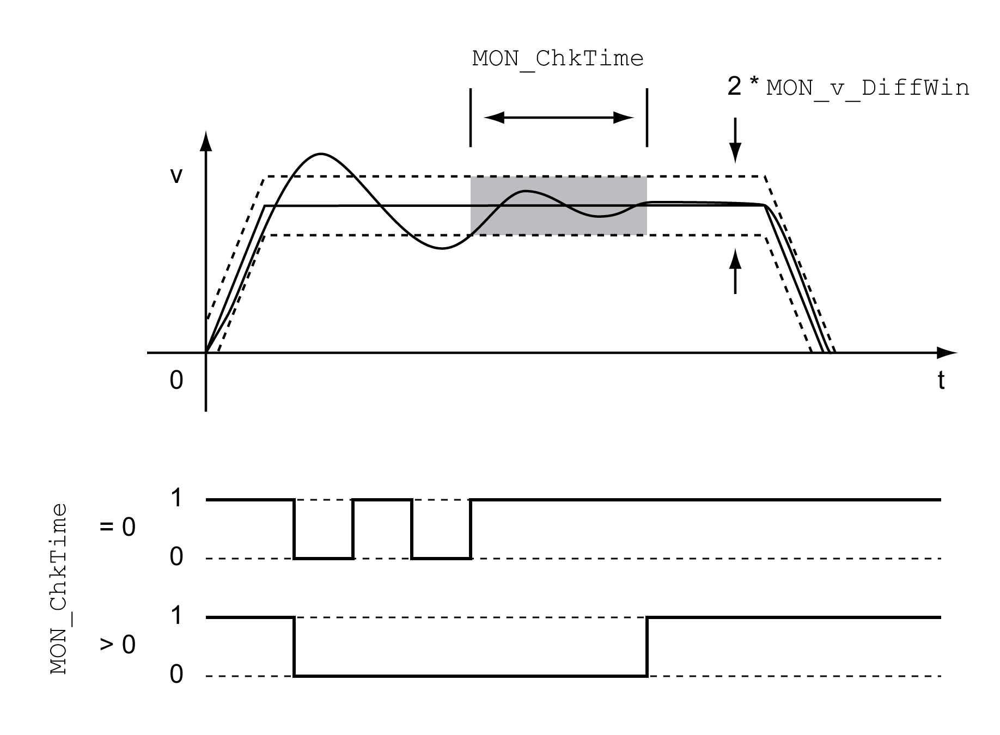

# Velocity Deviation Window

## Description

The velocity deviation window allows you to monitor whether the motor is within a parameterizable velocity deviation.

The velocity deviation is the difference between the reference velocity and the actual velocity.

The velocity deviation window comprises velocity deviation and monitoring time.

## Availability

The velocity deviation window is available in the following operating modes.

* Jog
* Homing
* Cyclic Synchronous Velocity
* Cyclic Synchronous Position

## Settings

The parameters MON\_v\_DiffWin and MON\_ChkTime specify the size of the window.

## Status Indication

The status is available via a signal output.

In order to read the status via a signal output, you must first parameterize the signal output function "In Velocity Deviation Window", see [Digital Signal Inputs and Digital Signal Outputs](DigitalSignalInputsAndDigitalSignal-C50B3C34.html#DigitalSignalInputsAndDigitalSignal-C50B3C34).

The parameter MON\_ChkTime acts on the parameters MON\_p\_DiffWin\_usr, MON\_v\_DiffWin, MON\_v\_Threshold and MON\_I\_Threshold.

| Parameter name  HMI menu  HMI name | Description | Unit  Minimum value  Factory setting  Maximum value | Data type  R/W  Persistent  Expert | Parameter address via fieldbus |
| --- | --- | --- | --- | --- |
| MON\_v\_DiffWin | Monitoring of velocity deviation.  The system monitors whether the drive is within the defined deviation during the period set with MON\_ChkTime.  The status can be output via a parameterizable output.  Type: Unsigned decimal - 4 bytes  Write access via Sercos: CP2, CP3, CP4  Modified settings become active immediately. | usr\_v  1  10  2147483647 | UINT32  R/W  per.  - | Modbus 1588  IDN P-0-3006.0.26 |
| MON\_ChkTime  ****(ConF)**** → ****(i-o-)****  ****(tthr)**** | Monitoring of time window.  Adjustment of a time for monitoring of position deviation, velocity deviation, velocity value and current value. If the monitored value is in the permissible range during the adjusted time, the monitoring function delivers a positive result.  The status can be output via a parameterizable output.  Type: Unsigned decimal - 2 bytes  Write access via Sercos: CP2, CP3, CP4  Modified settings become active immediately. | ms  0  0  9999 | UINT16  R/W  per.  - | Modbus 1594  IDN P-0-3006.0.29 |

0198441114060.03

© 2021

Schneider Electric.

All rights reserved.