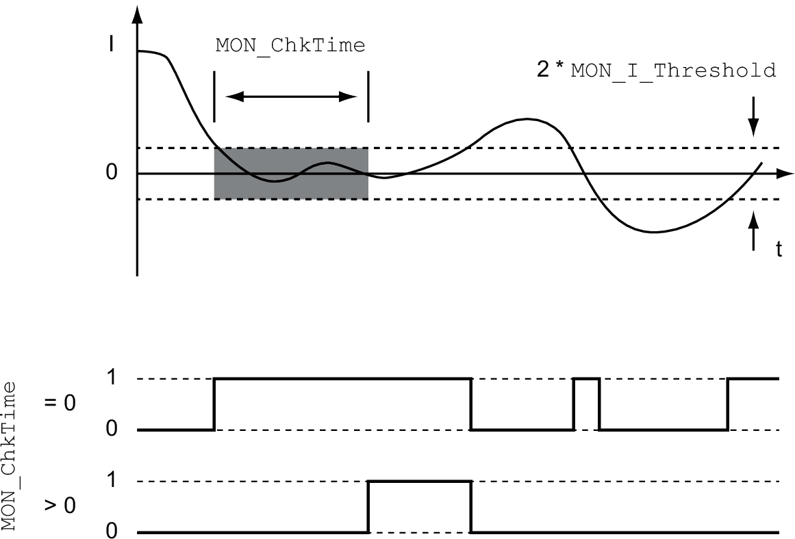

# Current Threshold Value

## Description

The current threshold value allows you to monitor whether the actual current is below a parameterizable current value.

The current threshold value comprises the current value and the monitoring time.

## Settings

The parameters MON\_I\_Threshold and MON\_ChkTime specify the size of the window.

## Status Indication

The status is available via a signal output.

In order to read the status via a signal output, you must first parameterize the signal output function "Current Below Threshold", see [Digital Signal Inputs and Digital Signal Outputs](DigitalSignalInputsAndDigitalSignal-C50B3C34.html#DigitalSignalInputsAndDigitalSignal-C50B3C34).

The parameter MON\_ChkTime acts on the parameters MON\_p\_DiffWin\_usr, MON\_v\_DiffWin, MON\_v\_Threshold and MON\_I\_Threshold.

| Parameter name  HMI menu  HMI name | Description | Unit  Minimum value  Factory setting  Maximum value | Data type  R/W  Persistent  Expert | Parameter address via fieldbus |
| --- | --- | --- | --- | --- |
| MON\_I\_Threshold  ****(ConF)**** → ****(i-o-)****  ****(ithr)**** | Monitoring of current threshold.  The system monitors whether the drive is below the defined value during the period set with MON\_ChkTime.  The status can be output via a parameterizable output.  The parameter \_Iq\_act\_rms is used as comparison value.  Type: Unsigned decimal - 2 bytes  Write access via Sercos: CP2, CP3, CP4  In increments of 0.01 Arms.  Modified settings become active immediately. | Arms  0.00  0.20  300.00 | UINT16  R/W  per.  - | Modbus 1592  IDN P-0-3006.0.28 |
| MON\_ChkTime  ****(ConF)**** → ****(i-o-)****  ****(tthr)**** | Monitoring of time window.  Adjustment of a time for monitoring of position deviation, velocity deviation, velocity value and current value. If the monitored value is in the permissible range during the adjusted time, the monitoring function delivers a positive result.  The status can be output via a parameterizable output.  Type: Unsigned decimal - 2 bytes  Write access via Sercos: CP2, CP3, CP4  Modified settings become active immediately. | ms  0  0  9999 | UINT16  R/W  per.  - | Modbus 1594  IDN P-0-3006.0.29 |

0198441114060.03

© 2021

Schneider Electric.

All rights reserved.