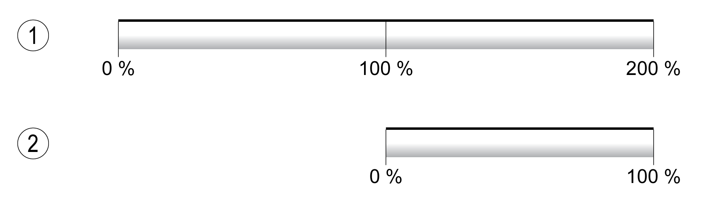

# Monitoring Load and Overload (I2T Monitoring)

## Description

The load is the thermal load on the power stage, the motor and the braking resistor.

Load and overload on the individual components are monitored internally; the values can be read by means of parameters.

Overload starts at a load value of 100 %.

**1** Load

**2** Overload

## Load Monitoring

The load can be read using the following parameters:

| Parameter name  HMI menu  HMI name | Description | Unit  Minimum value  Factory setting  Maximum value | Data type  R/W  Persistent  Expert | Parameter address via fieldbus |
| --- | --- | --- | --- | --- |
| \_PS\_load  ****(Mon)****  ****(LdFP)**** | Load of power stage.  Type: Signed decimal - 2 bytes | %  -  -  - | INT16  R/-  -  - | Modbus 7214  IDN P-0-3028.0.23 |
| \_M\_load  ****(Mon)****  ****(LdFM)**** | Load of motor.  Type: Signed decimal - 2 bytes | %  -  -  - | INT16  R/-  -  - | Modbus 7220  IDN P-0-3028.0.26 |
| \_RES\_load  ****(Mon)****  ****(LdFb)**** | Load of braking resistor.  The braking resistor set via parameter RESint\_ext is monitored.  Type: Signed decimal - 2 bytes | %  -  -  - | INT16  R/-  -  - | Modbus 7208  IDN P-0-3028.0.20 |

## Overload Monitoring

In the case of 100 % overload of the power stage or the motor, the current is limited internally. In the case of 100 % overload of the braking resistor, the braking resistor is deactivated.

The overload and the peak value can be read using the following parameters:

| Parameter name  HMI menu  HMI name | Description | Unit  Minimum value  Factory setting  Maximum value | Data type  R/W  Persistent  Expert | Parameter address via fieldbus |
| --- | --- | --- | --- | --- |
| \_PS\_overload | Overload of power stage.  Type: Signed decimal - 2 bytes | %  -  -  - | INT16  R/-  -  - | Modbus 7240  IDN P-0-3028.0.36 |
| \_PS\_maxoverload | Maximum value of overload of power stage.  Maximum overload of power stage during the last 10 seconds.  Type: Signed decimal - 2 bytes | %  -  -  - | INT16  R/-  -  - | Modbus 7216  IDN P-0-3028.0.24 |
| \_M\_overload | Overload of motor (I2t).  Type: Signed decimal - 2 bytes | %  -  -  - | INT16  R/-  -  - | Modbus 7218  IDN P-0-3028.0.25 |
| \_M\_maxoverload | Maximum value of overload of motor.  Maximum overload of motor during the last 10 seconds.  Type: Signed decimal - 2 bytes | %  -  -  - | INT16  R/-  -  - | Modbus 7222  IDN P-0-3028.0.27 |
| \_RES\_overload | Overload of braking resistor (I2t).  The braking resistor set via parameter RESint\_ext is monitored.  Type: Signed decimal - 2 bytes | %  -  -  - | INT16  R/-  -  - | Modbus 7206  IDN P-0-3028.0.19 |
| \_RES\_maxoverload | Maximum value of overload of braking resistor.  Maximum overload of braking resistor during the last 10 seconds.  The braking resistor set via parameter RESint\_ext is monitored.  Type: Signed decimal - 2 bytes | %  -  -  - | INT16  R/-  -  - | Modbus 7210  IDN P-0-3028.0.21 |

0198441114060.03

© 2021

Schneider Electric.

All rights reserved.