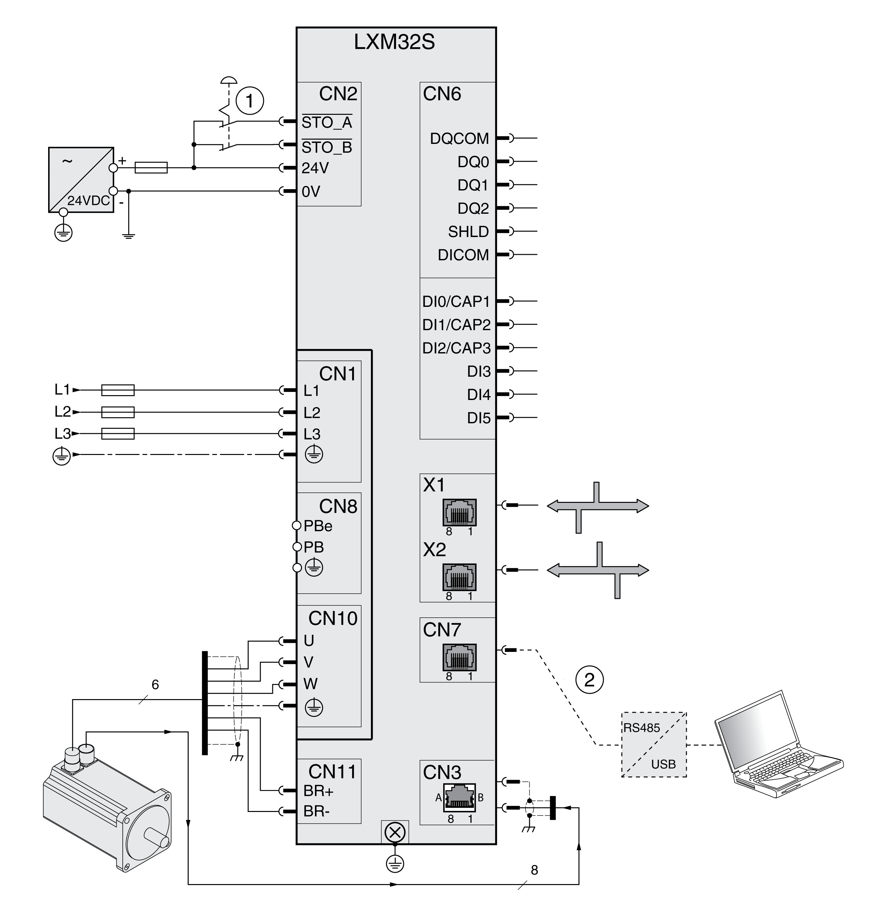

# Examples

## General Information

The examples show some typical applications of the product. The examples are intended to provide an overview; they are not exhaustive wiring plans.

The examples described here are intended for learning purposes only. In general, they are intended to help you understand how to develop, test, commission, and integrate application logic and/or the device wiring of the equipment associated with your own design in your control systems. The examples are not intended to be used directly on products that are part of a machine or process.

| WARNING | |
| --- | --- |
|  | UNINTENDED EQUIPMENT OPERATION  Do not include any wiring information, programming or configuration logic, or parameterization values from the Examples in your machine or process without thoroughly testing your entire application.  Failure to follow these instructions can result in death, serious injury, or equipment damage. |

Using the safety function STO integrated in this product requires careful planning. See section [Functional Safety](FunctionalSafety-C41F7D55.html#FunctionalSafety-C41F7D55) for additional information.

## Example of Operation via Fieldbus

The product is controlled via SERCOS 3.

Wiring example

**1** EMERGENCY STOP

**2** Commissioning accessories

0198441114060.03

© 2021

Schneider Electric.

All rights reserved.