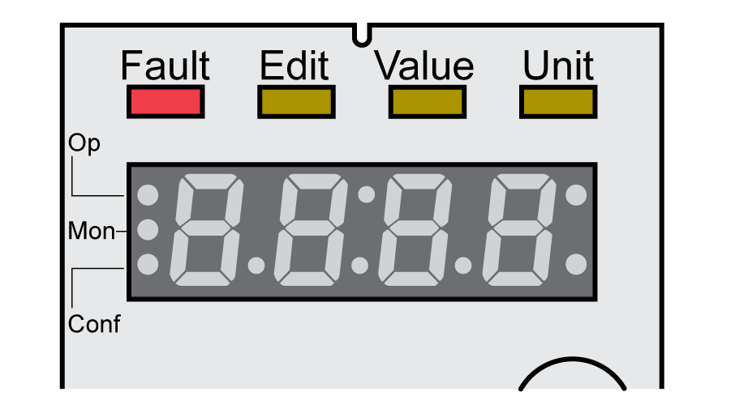

# Diagnostics via the Integrated HMI

## Overview

The 7-segment display provides the user with information.

With the factory setting, the 7-segment display shows the operating states. The operating states are described in section [Operating States](OperatingStates-CE71C65E.html#OperatingStates-CE71C65E).

| Message | Description |
| --- | --- |
| **(**INIT**)** | Operating state **1** Start |
| **(**nrdy**)** | Operating state **2** Not Ready To Switch On |
| **(**dis**)** | Operating state **3** Switch On Disabled |
| **(**rdy**)** | Operating state **4** Ready To Switch On |
| **(**son**)** | Operating state **5** Switched On |
| **(**run**)** and **(**halt**)** | Operating state **6** Operation Enabled |
| **(**stop**)** | Operating state **7** Quick Stop Active |
| **(**flt**)** | Operating state **8** Fault Reaction Active and **9** Fault |

## Additional Messages

The table below provides an overview of the messages that can additionally be displayed on the integrated HMI.

| Message | Description |
| --- | --- |
| **(**Card**)** | Data on the memory card differs from data in the product. See [Memory Card](MemoryCard-C498DF0B.html#MemoryCard-C498DF0B) for information on how to proceed. |
| **(**disp**)** | An external HMI is connected. The integrated HMI has no function. |
| **(**fsu**)** | Perform a First Setup. See [Powering on the Device for the First Time](PoweringOnTheDeviceForTheFirstTime-C40C8F59.html#PoweringOnTheDeviceForTheFirstTime-C40C8F59). |
| **(**mot**)** | A new motor was detected. See section [Acknowledging a Motor Change](AcknowledgingAMotorChange-CE4E6857.html#AcknowledgingAMotorChange-CE4E6857) for replacing a motor. |
| **(**prot**)** | Parts of the integrated HMI were locked with the parameter HMIlocked. |
| **(**slt1**)** ... **(**slt2**)** | The device has detected a different equipment with modules. See section [Acknowledging a Module Replacement](AcknowledgingAModuleReplacement-CE4EEE2A.html#AcknowledgingAModuleReplacement-CE4EEE2A) for replacing modules. |
| **(**ulow**)** | 24 Vdc control supply during initialization not high enough. |
| **(**8888**)** | Undervoltage 24 Vdc control supply. |
| **(**wdog**)** | Undeterminable system error. Contact your Schneider Electric representative. |
| **(**----**)** | Firmware not available. Retry to flash the firmware. If the condition persists, contact your Schneider Electric representative. |

If the HMI displays a message that is not contained in this user guide, contact your Schneider Electric representative.

0198441114060.03

© 2021

Schneider Electric.

All rights reserved.