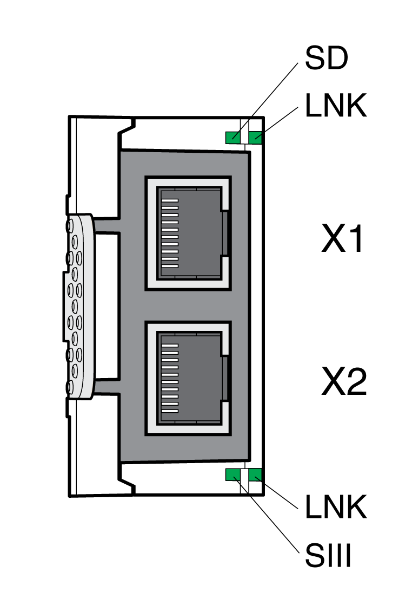

# Fieldbus Status LEDs

## General

The fieldbus status LEDs indicate the status of the fieldbus.

Overview of the LEDs

LED LNK

| Status | Meaning |
| --- | --- |
|  | No link |
|  | Link, 10 MBit, no activity |
|  | Link, 10 MBit, activity |
|  | Link, 100 MBit, no activity |
|  | Link, 100 MBit, activity |

LED SIII

| Status | Meaning |
| --- | --- |
|  | No communication |
|  | Communication phase 0 active |
|  | Communication phase 1 active |
|  | Communication phase 2 active |
|  | Communication phase 3 active |
|  | Communication phase 4 active |
|  | Real-time state is "loopback" |
|  | Application error |
|  | MST transmission error ≥S-0-1003/2 |
|  | Communication error |
|  | Identification ("IdentifyDevice") |

LED SD

| Status | Meaning |
| --- | --- |
|  | Sub-device is not active |
|  | Sub-device is in state "parametrization level (PL)" |
|  | Sub-device is in state "operating level (OL)" |
|  | Sub-device is in state "application error (C1D)" |

0198441114060.03

© 2021

Schneider Electric.

All rights reserved.