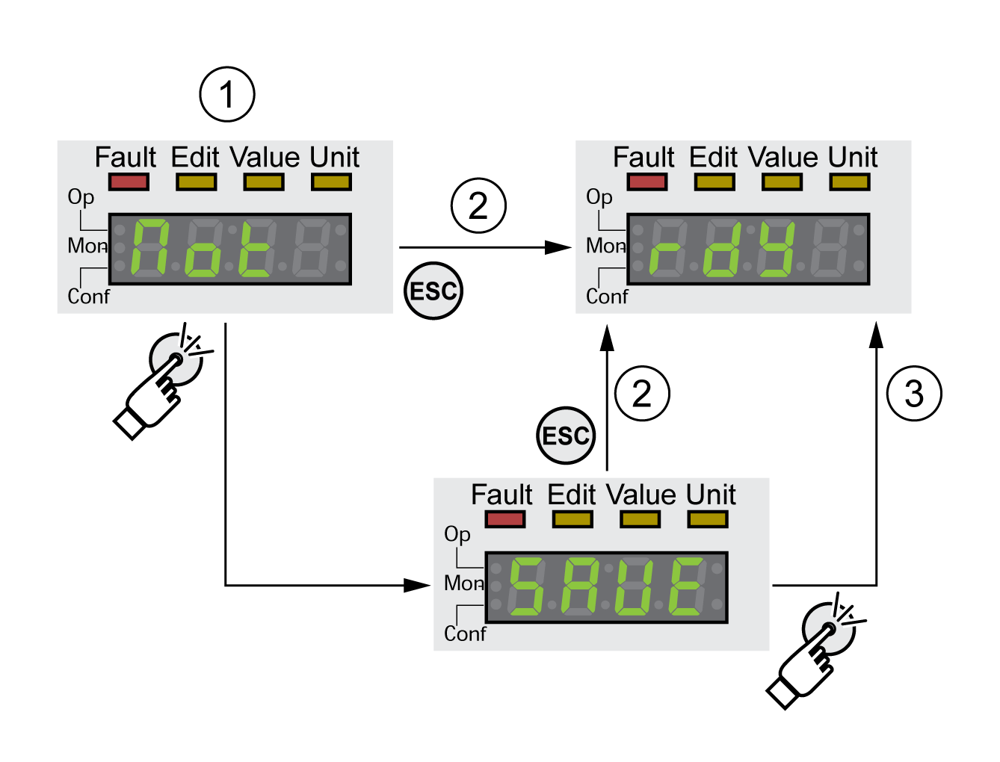

# Acknowledging a Motor Change

## Description

Procedure for confirming a motor change via the integrated HMI.

If the 7-segment display shows **(**mot**)**:

* Press the navigation button.

  The 7-segment display shows **(**save**)**.
* Press the navigation button to save the new motor parameters to the nonvolatile memory.

  The drive switches to operating state **4** Ready To Switch On.

Confirming a motor change via the integrated HMI

**1** HMI displays that a replacement of a motor has been detected.

**2** Canceling the saving process

**3** Saving switching to operating state **4** Ready To Switch On.

0198441114060.03

© 2021

Schneider Electric.

All rights reserved.