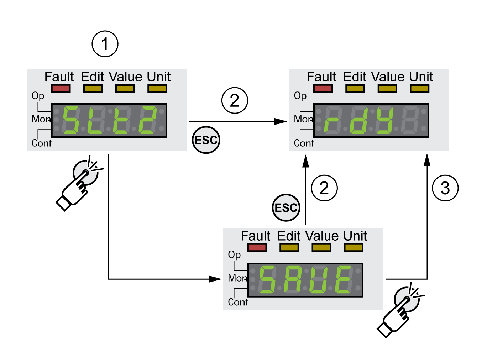

# Acknowledging a Module Replacement

## General

Note the information in the user guides for the respective modules.

## Slot 1

If the safety module eSM is used in Slot 1, refer to the user guide for the safety module eSM for information on replacing a module in slot 1.

Otherwise, follow the procedure for Slot 2.

## Slot 2

The replacement of a module is confirmed via the integrated HMI.

The 7-segment display shows **(**slt2**)**.

* Press the navigation button.

  The 7-segment display shows **(**save**)**.
* Press the navigation button.

  The drive switches to operating state **4** Ready To Switch On.

Confirming a module change via the integrated HMI

**1** HMI displays that a replacement of a module has been detected.

**2** Canceling the saving process

**3** Saving switching to operating state **4** Ready To Switch On.

0198441114060.03

© 2021

Schneider Electric.

All rights reserved.