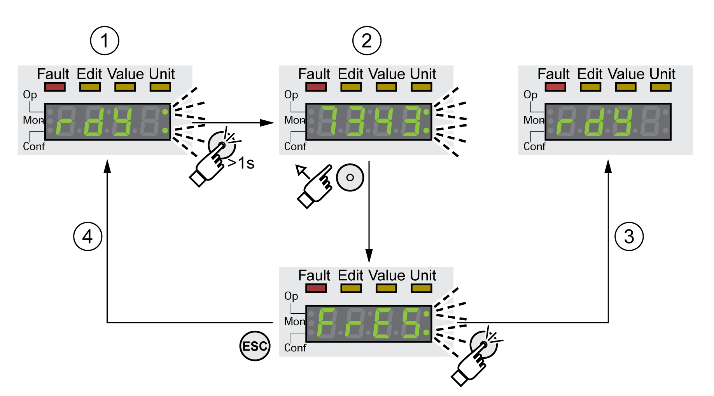
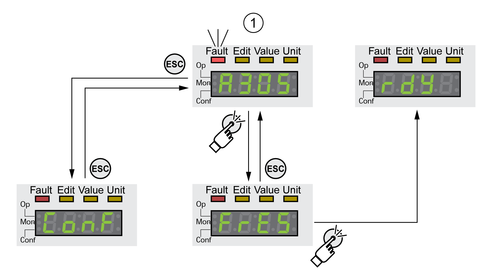

# Displaying Error Messages via the HMI

## Resetting Errors of Error Class 0

If there are errors of error class 0, the two dots to the right of the 7-segment display (2) flash. The error code is not directly displayed on the 7-segment display, but must be explicitly queried by the user.

Procedure for displaying and resetting:

* Press the navigation button and hold it down.

  The 7-segment display shows the error code.
* Release the navigation button.

  The 7-segment display shows **(**fres**)**.
* Remedy the cause.
* Press the navigation button to reset the error message.

  The 7-segment display returns to the initial state.

**1** HMI shows an error of error class 0

**2** Indication of error code

**3** Resetting an error message

**4** Canceling (the error code remains in the memory)

See [Error Messages](ErrorMessages-CE4F178A.html#ErrorMessages-CE4F178A) for the meaning of the error codes.

## Reading and Acknowledging Errors of Error Classes 1 ...4

In the case of a detected error of error class 1, the error code and **(**stop**)** are alternately shown on the 7 segment display.

In the case of a detected error of error class 2 ... 4, the error code and **(**flt**)** are alternately shown on the 7 segment display.

Procedure for displaying and resetting:

* Remedy the cause.
* Press the navigation button.

  The 7-segment display shows **(**fres**)**.
* Press the navigation button to reset the error message.

  The product switches to operating state **4** Ready To Switch On.

**1** HMI shows and error message with an error code

See [Error Messages](ErrorMessages-CE4F178A.html#ErrorMessages-CE4F178A) for the meaning of the error codes.

0198441114060.03

© 2021

Schneider Electric.

All rights reserved.