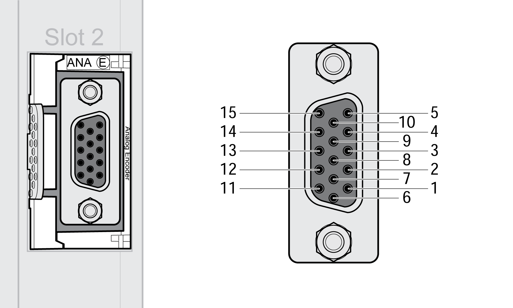
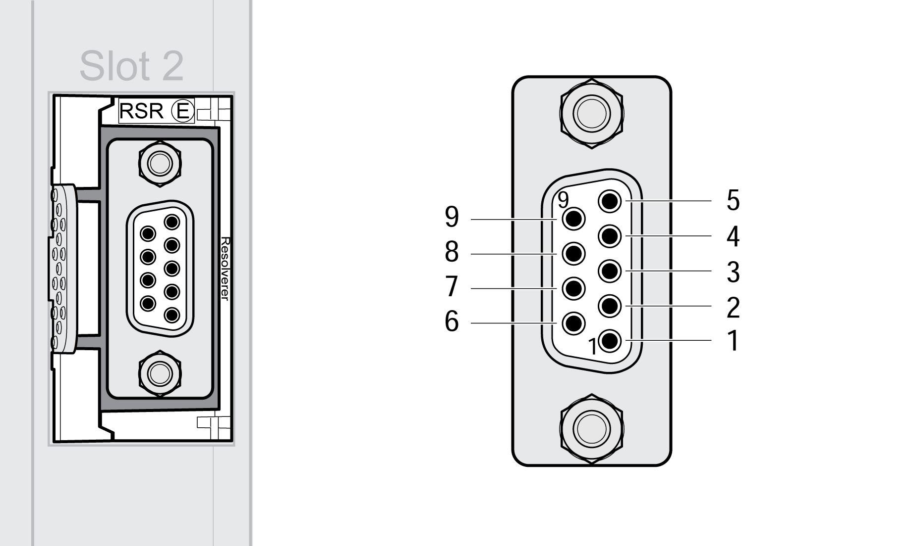

# Cable Specification and Pin Assignment

## Encoder Module ANA (Analog Interface)

Cable specification:

| Characteristic | Value |
| --- | --- |
| Shield: | Required, both ends grounded |
| Twisted Pair: | Required |
| PELV: | Required |
| Typical cable composition: | 3 \* 2 \* 0.14 mm2 + 2 \* 0.34 mm2  (3 \* 2 \* AWG 26 + 2 \* AWG 22) |
| Maximum cable length: | 100 m (328 ft) |

Pin assignment:

| Pin | Signal  SinCos Hiperface | Signal  SinCos 1Vpp  (without Hall) | Signal  SinCos 1Vpp  (with Hall) | Wire pair | Meaning |
| --- | --- | --- | --- | --- | --- |
| 1 | DATA+ | INDEX+ | INDEX+ | 1 | Data signal / index pulse |
| 2 | DATA- | INDEX- | INDEX- | 1 | Data signal / index pulse |
| 3 | - | - | HALL\_U | - | Hall effect signal(1) |
| 4 | SIN+ | SIN+ | SIN+ | 2 | Sine signal |
| 5 | REFSIN | REFSIN | REFSIN | 2 | Reference for sine signal |
| 6 | - | - | HALL\_V | - | Hall effect signal(1) |
| 7 | ENC+12V\_OUT | ENC+12V\_OUT | ENC+12V\_OUT | 4a(2) | Encoder supply 12 Vdc and 100 mA |
| 8 | ENC\_0V / TEMP | ENC\_0V / TEMP | ENC\_0V / TEMP | 4 | Reference potential for encoder supply and for Hall effect signals |
| 9 | COS+ | COS+ | COS+ | 3 | Cosine signal |
| 10 | REFCOS | REFCOS | REFCOS | 3 | Reference for cosine signal |
| 11 | - | - | HALL\_W | - | Hall effect signal(1) |
| 12 | TEMP+ | TEMP+ | TEMP+ | - | Temperature sensor PTC(3)(4) |
| 13 | TEMP- | TEMP- | TEMP- | - | Temperature sensor PTC(3) |
| 14 | - | - | - | - | Reserved |
| 15 | - | ENC+5V\_OUT | ENC+5V\_OUT | 4b(2) | Encoder supply 5 Vdc and 200 mA |
| - | SHLD | - | - | - | The shield is connected in the connector via the housing. |
| **(1)** The Hall effect signal inputs have an internal resistor with 1 kΩ pull-up to 5 Vdc.  **(2)** The supply voltage can be adjusted via parameter to 5 Vdc or 12 Vdc to match the encoder. Depending on this setting, either pin ENC+5V\_OUT or pin ENC+12V\_OUT provides the supply voltage.  **(3)** Temperature is only monitored if the encoder is used as a motor encoder.  **(4)** If no temperature sensor is connected, pin 12 and pin 8 must be bridged. In this case, limit the motor temperature by means of other measures. | | | | | |

## Encoder Module DIG (Digital Interface)

Cable specification:

| Characteristic | Value |
| --- | --- |
| Shield: | Required, both ends grounded |
| Twisted Pair: | Required |
| PELV: | Required |
| Typical cable composition: | 3 \* 2 \* 0.14 mm2 + 2 \* 0.34 mm2  (3 \* 2 \* AWG 26 + 2 \* AWG 22) |
| Maximum cable length: | The maximum cable length depends on the transmission rate and the protocol, see chapter [Maximum Cable Length](D-SE-0071514.html#D-SE-0071514__D-SE-0071514.4). |

Pin assignment:

| Pin | Signal | Wire pair | Meaning | EnDat 2.2  BiSS  SSI | ABI |
| --- | --- | --- | --- | --- | --- |
| 1 | DATA\_A+ | 1(1) | Data signal / channel A | Required | Required |
| 2 | DATA\_A- | 1(1) | Data signal / channel A (inverted) | Required | Required |
| 3 | - | - | Reserved | - | - |
| 4 | I+ | 3(1) | Index pulse | - | Optional |
| 5 | I- | 3(1) | Index pulse | - | Optional |
| 6 | CLK+ | 4 | Clock signal RS485 | Required | - |
| 7 | ENC+12V\_OUT | 5a(2) | Encoder supply 12 Vdc and 100 mA | Optional | Optional |
| 8 | ENC\_0V | 5 | Reference potential for encoder supply | Required | Required |
| 9 | - |  | Reserved | - | - |
| 10 | DATA\_B+ | 2(1) | Channel B | - | Required |
| 11 | DATA\_B- | 2(1) | Channel B (inverted) | - | Required |
| 12 | - | - | Reserved | - | - |
| 13 | - | - | Reserved | - | - |
| 14 | CLK- | 4 | Clock signal RS485 | Required | - |
| 15 | ENC+5V\_OUT | 5b(2) | Encoder supply 5 Vdc and 200 mA | Optional | Optional |
| - | SHLD | - | The shield is connected in the connector via the housing. | Required | Required |
| **(1)** RS422 signals.  **(2)** The supply voltage can be adjusted to 5 Vdc or 12 Vdc to match the encoder. Depending on this setting, either pin ENC+5V\_OUT or pin ENC+12V\_OUT provides the supply voltage. | | | | | |

## Encoder Module RSR (Resolver Interface)

Cable specification:

| Characteristic | Value |
| --- | --- |
| Shield: | Shielded cable with additionally shielded wire pairs, shield of the wire pairs to pin 1, outer shield grounded at both ends |
| Twisted Pair: | Required |
| PELV: | Required |
| Cable composition: | 3 \* 2 \* 0.14 mm2 + 2 \* 1.0 mm2  (3 \* 2 \* AWG 26 + 2 \* AWG 18) |
| Maximum cable length: | 100 m (328 ft) |

NOTE: See the user guide for your drive for important information concerning equipotential grounding of equipment.

Pin assignment:

| Pin | Signal | Color(1) | Typical connection designation | Meaning |
| --- | --- | --- | --- | --- |
| 1 | SHLD2 |  | - | Inner cable shields |
| 2 | TEMP+(2) |  | - | Temperature sensor PTC |
| 3 | COS- | Gray | S4 | Cosine signal |
| 4 | SIN+ | Yellow | S1 | Sine signal |
| 5 | REF+ | Red | R2 | Reference signal |
| 6 | TEMP-(2) |  | - | Temperature sensor PTC |
| 7 | COS+ | Pink | S2 | Cosine signal |
| 8 | SIN- | Green | S3 | Sine signal |
| 9 | REF- | Blue | R1 | Reference signal |
|  | SHLD |  | - | The shield is connected in the connector via the housing. The inner cable jackets must be isolated from the outer cable jacket. |
| **(1)** The colors relate to the cable “Helu Topgeber 510 77744”.  **(2)** If no temperature sensor is connected, pin 2 and pin 6 must be bridged. In this case, limit the motor temperature by means of other measures. | | | | |

EIO0000003981.01

© 2021

Schneider Electric.

All rights reserved.