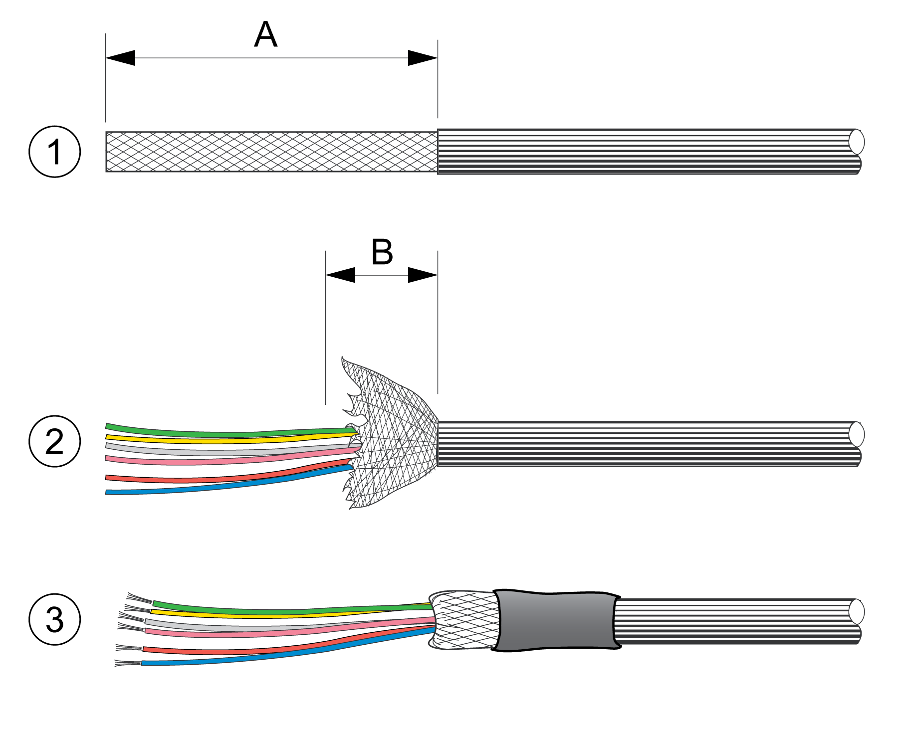
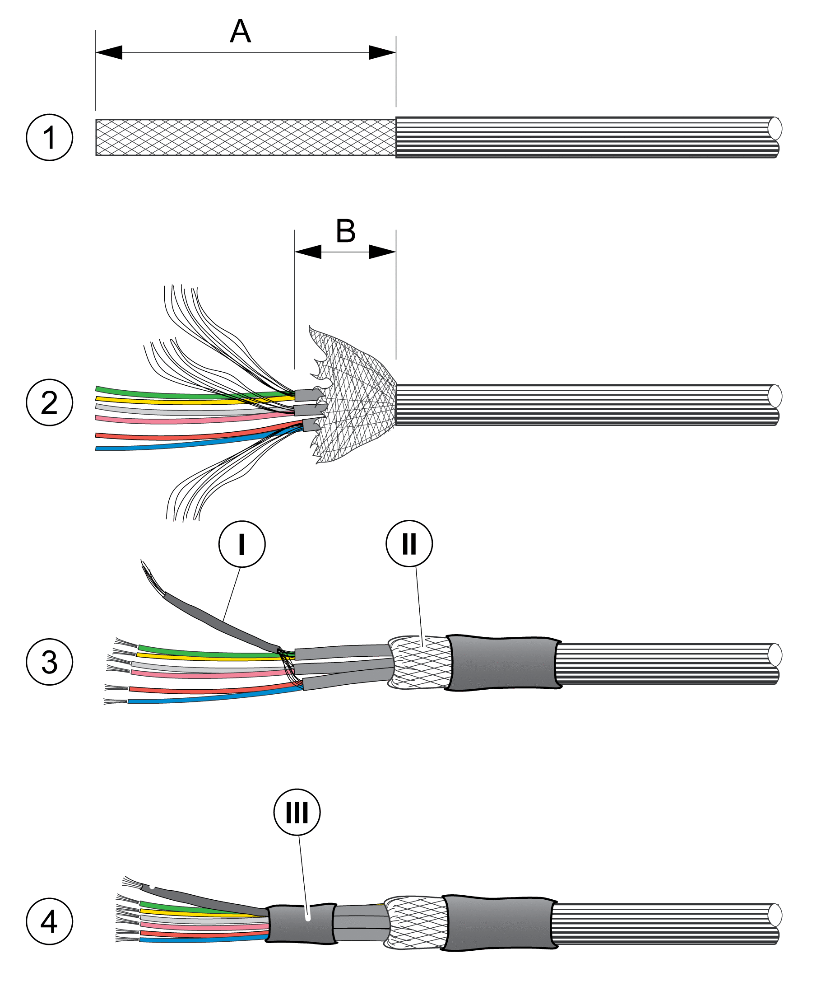

# Cable Assembly

## Cable Assembly for Encoder Modules ANA (Analog Interface) and DIG (Digital Interface)

| Step | Action |
| --- | --- |
| 1 | Shorten the outer cable jacket of the cable. Length A depends on the connector used. |
| 2 | Shorten the outer shield (B) to a length of approximately 20 mm (0.79 in). |
| 3 | Slide the outer shield back over the outer cable jacket and fixate it with heat shrink tube in such a way that at least 10 mm (0.39 in) of the shield remains stripped. The stripped piece of shield will later be clamped into the metallic strain relief of the connector for a connection with the housing. |

## Cable Assembly for Encoder Module RSR (Resolver Interface)

| Step | Action |
| --- | --- |
| 1 | Shorten the outer cable jacket of the cable. Length A depends on the connector used. |
| 2 | Shorten the outer shield (B) to a length of approximately 20 mm (0.79 in). Shorten the jackets of the inner shields. The inner jackets must be at least 10 mm (0.39 in) longer than the outer jacket. |
| 3 | Isolate the inner shields together with heat shrink tube (I). Slide the outer shield back over the outer cable jacket and fixate it with heat shrink tube in such a way that at least 10 mm (0.39 in) of the shield remains stripped. The stripped piece of shield (II) will later be clamped into the metallic strain relief of the connector for a connection with the housing. |
| 4 | Isolate the transition of the inner shields into the heat shrink tube with an additional piece of heat shrink tube (III). |

EIO0000003981.01

© 2021

Schneider Electric.

All rights reserved.