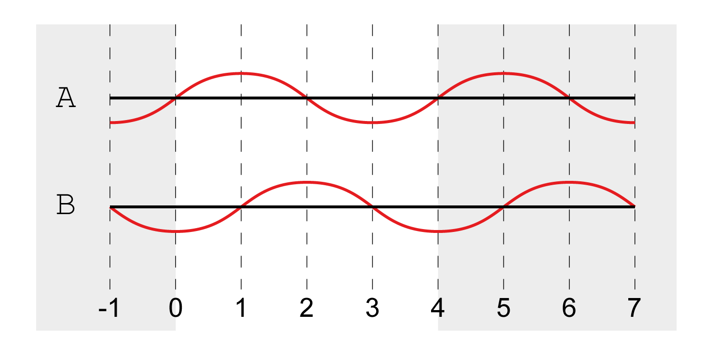
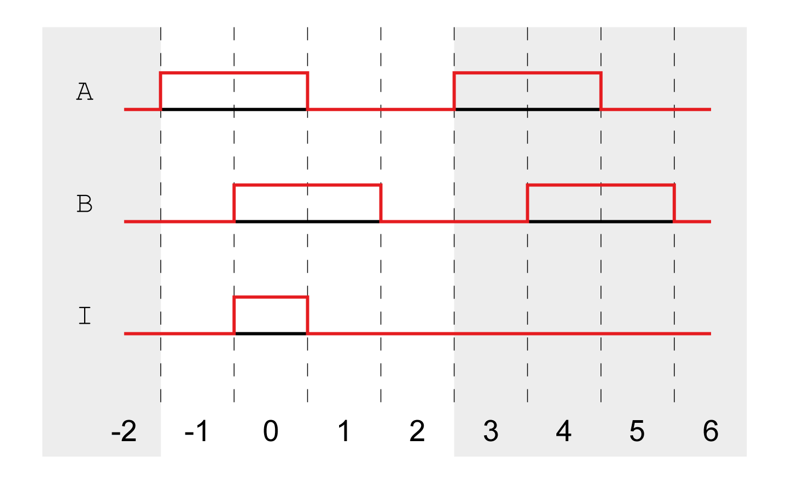

# Working with Encoder Increments

## Definition of Encoder Increments for Analog Encoders

For analog encoders, 1 period (line) corresponds to 4 encoder increments.

One period for analog encoders:

## Definition of Encoder Increments for Digital Encoders With the Interface ABI

For digital encoders with the interface ABI, 1 period (line) corresponds to 4 encoder increments.

One period for digital encoders with the interface ABI:

## Definition of Encoder Increments for Digital Encoders With the Interface EnDat 2.2, BiSS or SSI

For digital encoders with the interface EnDat 2.2, BiSS or SSI, bit 0 (LSB) corresponds to 1 encoder increment.

EIO0000003981.01

© 2021

Schneider Electric.

All rights reserved.