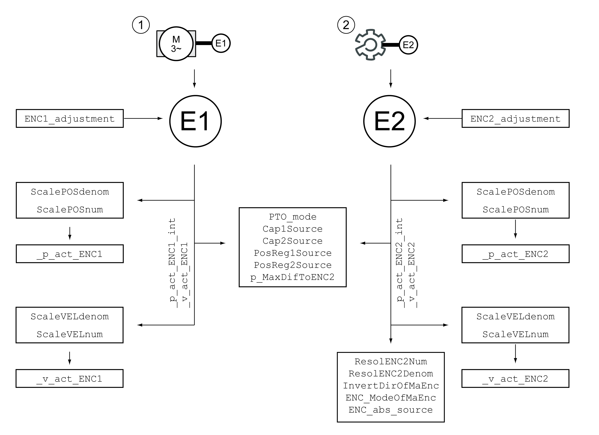

# Usage as a Machine Encoder

## Overview

If the encoder module is used to connect a machine encoder, you must first set the interface parameters to enable communication between the encoder and the encoder module.

Once you have set the parameters for the supply voltage and the interface, the machine encoder must be adapted to the mechanical situation.

The illustration below shows an overview of the affected parameters:

**1** Motor encoder

**2** Machine encoder

EIO0000003981.01

© 2021

Schneider Electric.

All rights reserved.