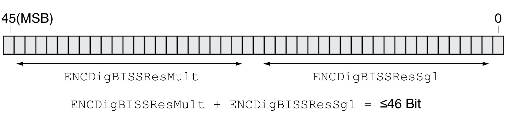

# Settings for the Interface BiSS

## Setting the Position Coding

Transmission via the BiSS protocol requires the data to be available as pure position data. The data can be transmitted in Binary or Gray format.

The position coding can be set via the parameter ENCDigBISSCoding.

| Parameter name  HMI menu  HMI name | Description | Unit  Minimum value  Factory setting  Maximum value | Data type  R/W  Persistent  Expert | Parameter address via fieldbus |
| --- | --- | --- | --- | --- |
| ENCDigBISSCoding | Position coding of BiSS encoder.  **0 / binary**: Binary coding  **1 / gray**: Gray coding  This parameter defines the type of position coding of the BiSS encoder.  Type: Unsigned decimal - 2 bytes  Write access via Sercos: CP2, CP3, CP4  Setting can only be modified if power stage is disabled.  Modified settings become active the next time the product is powered on. | -  0  0  1 | UINT16  R/W  per.  - | Modbus 21012  IDN P-0-3082.0.10 |

## Setting the Resolution

The resolution can be set via the parameters ENCDigBISSResSgl and ENCDigBISSResMult. Together, the values of these parameters must not exceed 46 bits.

| Parameter name  HMI menu  HMI name | Description | Unit  Minimum value  Factory setting  Maximum value | Data type  R/W  Persistent  Expert | Parameter address via fieldbus |
| --- | --- | --- | --- | --- |
| ENCDigBISSResSgl | BiSS singleturn resolution.  This parameter is only relevant for BiSS encoders (singleturn and multiturn).  Example: If ENCDigBISSResSgl is set to 13, an BiSS encoder with a singleturn resolution of 2^13 = 8192 increments must be used.  If a multiturn encoder is used, the sum of ENCDigBISSResMult + ENCDigBISSResSgl must be less than or equal to 46 bits.  Type: Unsigned decimal - 2 bytes  Write access via Sercos: CP2, CP3, CP4  Setting can only be modified if power stage is disabled.  Modified settings become active the next time the product is powered on. | bit  8  13  25 | UINT16  R/W  per.  - | Modbus 21008  IDN P-0-3082.0.8 |
| ENCDigBISSResMul | BiSS multiturn resolution.  This parameter is only relevant for BiSS encoders (singleturn and multiturn). If a singleturn BiSS encoder is used, ENCDigBISSResMult must be set to 0.  Example: If ENCDigBISSResMult is set to 12, the number of turns of the encoder used must be 2^12 = 4096.  The sum of ENCDigBISSResMult + ENCDigBISSResSgl must be less than or equal to 46 bits.  Type: Unsigned decimal - 2 bytes  Write access via Sercos: CP2, CP3, CP4  Setting can only be modified if power stage is disabled.  Modified settings become active the next time the product is powered on. | bit  0  0  24 | UINT16  R/W  per.  - | Modbus 21010  IDN P-0-3082.0.9 |

EIO0000003981.01

© 2021

Schneider Electric.

All rights reserved.