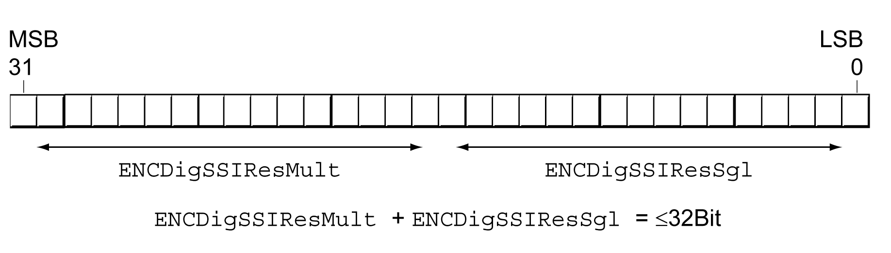
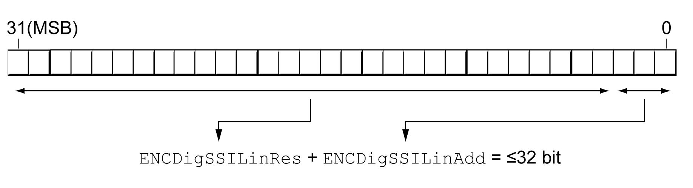

# Settings for the Interface SSI

## Setting the Position Coding

Transmission via the SSI protocol requires the data to be available as pure position data. The data can be transmitted in Binary or Gray format.

The position coding can be set via the parameter ENCDigSSICoding.

| Parameter name  HMI menu  HMI name | Description | Unit  Minimum value  Factory setting  Maximum value | Data type  R/W  Persistent  Expert | Parameter address via fieldbus |
| --- | --- | --- | --- | --- |
| ENCDigSSICoding | Position coding of SSI encoder.  **0 / binary**: Binary coding  **1 / gray**: Gray coding  This parameter defines the type of position coding of the SSI encoder.  Type: Unsigned decimal - 2 bytes  Write access via Sercos: CP2, CP3, CP4  Setting can only be modified if power stage is disabled.  Modified settings become active the next time the product is powered on. | -  0  0  1 | UINT16  R/W  per.  - | Modbus 20998  IDN P-0-3082.0.3 |

## Setting the Maximum Transfer Frequency

The maximum transfer frequency of the SSI interface can be set via the parameter ENCDigSSIMaxFreq.

| Parameter name  HMI menu  HMI name | Description | Unit  Minimum value  Factory setting  Maximum value | Data type  R/W  Persistent  Expert | Parameter address via fieldbus |
| --- | --- | --- | --- | --- |
| ENCDigSSIMaxFreq | SSI maximum transfer frequency.  This parameter is used to set the SSI transfer frequency for SSI encoders (singleturn and multiturn).  The SSI transfer frequency depends on the encoder (maximum frequency specified by the encoder manufacturer) and on the length of the encoder cable.  The encoder module supports SSI transfer frequencies of 200 kHz and 1000 kHz. If your SSI encoder supports a maximum frequency of 1000 kHz, set the value of this parameter to 1000.  If the length of the encoder cable in your system exceeds 50 m, set the value of this parameter to 200, regardless of the maximum possible frequency specified by the encoder manufacturer.  Type: Unsigned decimal - 2 bytes  Write access via Sercos: CP2, CP3, CP4  Setting can only be modified if power stage is disabled.  Modified settings become active the next time the product is powered on. | kHz  200  200  1000 | UINT16  R/W  per.  - | Modbus 21002  IDN P-0-3082.0.5 |

## Setting the Resolution for Rotary Encoders

The resolution for rotary encoders can be set via the parameters ENCDigSSIResSgl and ENCDigSSIResMult. Together, the values of these parameters must not exceed 32 bits.

| Parameter name  HMI menu  HMI name | Description | Unit  Minimum value  Factory setting  Maximum value | Data type  R/W  Persistent  Expert | Parameter address via fieldbus |
| --- | --- | --- | --- | --- |
| ENCDigSSIResSgl | SSI singleturn resolution (rotary).  This parameter is only relevant for SSI encoders (singleturn and multiturn).  Example: If ENCDigSSIResSgl is set to 13, an SSI encoder with a singleturn resolution of 2^13 = 8192 increments must be used.  If a multiturn encoder is used, the sum of ENCDigSSIResMult + ENCDigSSIResSgl must be less than or equal to 32 bits.  Type: Unsigned decimal - 2 bytes  Write access via Sercos: CP2, CP3, CP4  Setting can only be modified if power stage is disabled.  Modified settings become active the next time the product is powered on. | bit  8  13  25 | UINT16  R/W  per.  - | Modbus 20994  IDN P-0-3082.0.1 |
| ENCDigSSIResMult | SSI multiturn resolution (rotary).  This parameter is only relevant for SSI encoders (singleturn and multiturn). If a singleturn SSI encoder is used, ENCDigSSIResMult must be set to 0.  Example: If ENCDigSSIResMult is set to 12, the number of turns of the encoder used must be 2^12 = 4096.  The sum of ENCDigSSIResMult + ENCDigSSIResSgl must be less than or equal to 32 bits.  Type: Unsigned decimal - 2 bytes  Write access via Sercos: CP2, CP3, CP4  Setting can only be modified if power stage is disabled.  Modified settings become active the next time the product is powered on. | bit  0  0  24 | UINT16  R/W  per.  - | Modbus 20996  IDN P-0-3082.0.2 |

## Setting the Resolution for Linear Encoders

The resolution for linear encoders can be set via the parameter ENCDigSSILinRes.

Additional bits (if available) can be set via the parameter ENCDigSSILinAdd.

Together, the values of these parameters must not exceed 32 bits.

| Parameter name  HMI menu  HMI name | Description | Unit  Minimum value  Factory setting  Maximum value | Data type  R/W  Persistent  Expert | Parameter address via fieldbus |
| --- | --- | --- | --- | --- |
| ENCDigSSILinRes | SSI encoder resolution bits (linear).  This parameter is used to set the number of resolution bits of a linear SSI encoder. The total number of resolution bits (ENCDigSSILinRes) and additional bits (ENCDigSSILinAdd) is limited to 32.  Type: Unsigned decimal - 2 bytes  Write access via Sercos: CP2, CP3, CP4  Setting can only be modified if power stage is disabled.  Modified settings become active the next time the product is powered on.  Available with firmware version ≥V01.06. | bit  8  24  32 | UINT16  R/W  per.  - | Modbus 21016  IDN P-0-3082.0.12 |
| ENCDigSSILinAdd | SSI encoder additional bits (linear).  This parameter is used to set the number of resolution bits of a linear SSI encoder. The total number of resolution bits (ENCDigSSILinRes) and additional bits (ENCDigSSILinAdd) is limited to 32.  Type: Unsigned decimal - 2 bytes  Write access via Sercos: CP2, CP3, CP4  Setting can only be modified if power stage is disabled.  Modified settings become active the next time the product is powered on.  Available with firmware version ≥V01.06. | bit  0  0  3 | UINT16  R/W  per.  - | Modbus 21018  IDN P-0-3082.0.13 |

EIO0000003981.01

© 2021

Schneider Electric.

All rights reserved.