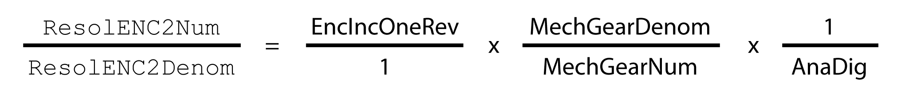
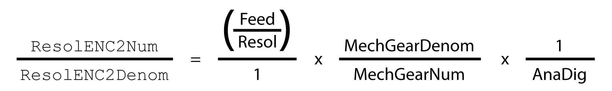

# Setting the Ratio Between Machine Encoder and Motor Encoder

## Overview

The ratio between the machine encoder and the motor encoder adjusts the machine encoder to the internal units of the drive.

Definition: A specific number of Encoder increments ResolENC2Num correspond to a specific number of motor revolutions ResolENC2Denom.

This can be determined either by calculation or by measuring.

## Calculating the Ratio for Rotary Encoders

Formula for calculation of the ratio:

| Item | Meaning |
| --- | --- |
| EncIncOneRev | Number of encoder increments of one revolution of the machine encoder.  For the definition of encoder increments, see [Definition of Encoder Increments](D-SE-0081120.html#D-SE-0081120__D-SE-0081120.3). |
| MechGearDenom(1) | Denominator of the mechanical gear.  Example: Value 2, if a mechanical gear with a ratio of 5:**2** is used. |
| MechGearNum(1) | Numerator of the mechanical gear.  Example: Value 5, if a mechanical gear with a ratio of **5**:2 is used. |
| AnaDig | For analog encoders: Value 4  For digital encoders: Value 1 |
| **(1)** If a mechanical gear is used. | |

Examples:

| Type of encoder | Mechanical gear | Result |
| --- | --- | --- |
| Analog encoder  Resolution: 20000 encoder increments (5000 periods/lines) per revolution of the machine encoder | None | ResolENC2Num: 20000 x 1 x 1 = 20000  ResolENC2Denom: 1 x 1 x 4 = 4 |
| Ratio 5:2 | ResolENC2Num: 20000 x 2 x 1 = 40000  ResolENC2Denom: 1 x 5 x 4 = 20 |
| Digital encoder ABI  Resolution: 20000 encoder increments (5000 periods/lines) per revolution of the machine encoder | None | ResolENC2Num: 20000 x 1 x 1 = 20000  ResolENC2Denom: 1 x 1 x 1 = 1 |
| Ratio 5:2 | ResolENC2Num: 20000 x 2 x 1 = 40000  ResolENC2Denom: 1 x 5 x 1 = 5 |
| Digital encoder EnDat 2.2, BiSS or SSI  Resolution: 8192 encoder increments (13 bits) per revolution of the machine encoder | None | ResolENC2Num: 8192 x 1 x 1 = 8192  ResolENC2Denom: 1 x 1 x 1 = 1 |
| Ratio 5:2 | ResolENC2Num: 8192 x 2 x 1 = 16384  ResolENC2Denom: 1 x 5 x 1 = 5 |

## Calculating the Ratio for Linear Encoders

Formula for calculation of the ratio:

| Item | Meaning |
| --- | --- |
| Feed | The feed of the linear axis with one revolution of the input shaft.  Use the same unit as for “Resol”. |
| Resol | The resolution of the machine encoder corresponding to 1 encoder increment.  Use the same unit as for “Feed”.  For the definition of encoder increments see chapter [Definition of Encoder Increments](D-SE-0081120.html#D-SE-0081120__D-SE-0081120.3). |
| MechGearDenom(1) | Denominator of the mechanical gear.  Example: Value 3, if a mechanical gear with a ratio of 7:**3** is used. |
| MechGearNum(1) | Numerator of the mechanical gear.  Example: Value 7, if a mechanical gear with a ratio of **7**:3 is used. |
| AnaDig | For analog encoders: Value 4  For digital encoders: Value 1 |
| **(1)** If a mechanical gear is used. | |

Examples:

| Type of encoder | Feed of the linear axis | Mechanical gear | Result |
| --- | --- | --- | --- |
| Analog encoder  Resolution: 1 periods/lines correspond to 0.02 mm, therefore 1 encoder increment correspond to 0.005 mm | One revolution of the input shaft correspond to 155 mm | None | ResolENC2Num: (155/0.005) x 1 x 1 = 31000  ResolENC2Denom: 1 x 1 x 4 = 4 |
| Ratio 7:3 | ResolENC2Num: (155/0.005) x 3 x 1 = 93000  ResolENC2Denom: 1 x 7 x 4 = 28 |
| Digital encoder ABI  Resolution: 1 periods/lines correspond to 0.02 mm, therefore 1 encoder increment correspond to 0.005 mm | One revolution of the input shaft correspond to 155 mm | None | ResolENC2Num: (155/0.005) x 1 x 1 = 31000  ResolENC2Denom: 1 x 1 x 1 = 1 |
| Ratio 7:3 | ResolENC2Num: (155/0.005) x 3 x 1 = 93000  ResolENC2Denom: 1 x 7 x 1 = 7 |
| Digital encoder EnDat 2.2 or SSI  Resolution: 1 encoder increment (1 bit) correspond to 0.005 mm | One revolution of the input shaft correspond to 155 mm | None | ResolENC2Num: (155/0.005) x 1 x 1 = 31000  ResolENC2Denom: 1 x 1 x 1 = 1 |
| Ratio 7:3 | ResolENC2Num: (155/0.005) x 3 x 1 = 93000  ResolENC2Denom: 1 x 7 x 1 = 7 |

## Measuring the Ratio (Alternative)

Procedure:

| Step | Action |
| --- | --- |
| 1 | Set the parameter ENC\_ModeOfMaEnc to the value 0 to keep the motor from being controlled during the procedure. |
| 2 | Read the value of the parameter \_Inc\_ENC2Raw using the commissioning software. |
| 3 | Move the motor shaft by exactly one revolution in positive direction using the commissioning software. |
| 4 | Calculate the difference between \_Inc\_ENC2Raw before and after the revolution of the motor. |
| 5 | Set the value of the parameter ResolENC2Num to the difference calculated. |
| 6 | Set the parameter ResolENC2Denom to:   * For analog encoders: Value 4 * For digital encoders: Value 1 |
| 7 | Reset the parameter ENC\_ModeOfMaEnc to the original value. |

| Parameter name  HMI menu  HMI name | Description | Unit  Minimum value  Factory setting  Maximum value | Data type  R/W  Persistent  Expert | Parameter address via fieldbus |
| --- | --- | --- | --- | --- |
| \_Inc\_ENC2Raw | Raw increment value of encoder 2.  This parameter is only needed for commissioning of encoder 2 in case of an indeterminable machine encoder resolution.  Type: Signed decimal - 4 bytes | EncInc  -  -  - | INT32  R/-  -  - | Modbus 7754  IDN P-0-3030.0.37 |

## Parameters for the Ratio

| Parameter name  HMI menu  HMI name | Description | Unit  Minimum value  Factory setting  Maximum value | Data type  R/W  Persistent  Expert | Parameter address via fieldbus |
| --- | --- | --- | --- | --- |
| ResolENC2Num | Resolution of encoder 2, numerator.  Digital encoders:  Specification of the encoder increments the external encoder returns for one or several revolutions of the motor shaft.  The value is indicated with a numerator and a denominator so that it is possible, for example, to take into account the gear ratio of a mechanical gearing.  The value must not be set to 0.  The resolution factor is not applied until this numerator value is specified.  Example: One motor revolution causes 1/3 encoder revolution at an encoder resolution of 16384 EncInc/revolution.  ResolENC2Num = 16384 EncInc  ResolENC2Denom = 3 revolutions  Analog encoders:  Num/Denom must be set equivalent to the number of analog periods per 1 motor revolution.  Example: One motor revolution causes 1/3 encoder revolution at an encoder resolution of 16 analog periods per revolution.  ResolENC2Num = 16 periods  ResolENC2Denom = 3 revolutions  Type: Signed decimal - 4 bytes  Write access via Sercos: CP2, CP3, CP4  Setting can only be modified if power stage is disabled.  Modified settings become active the next time the power stage is enabled. | EncInc  1  10000  2147483647 | INT32  R/W  per.  - | Modbus 20492  IDN P-0-3080.0.6 |
| ResolENC2Denom | Resolution of encoder 2, denominator.  See numerator (ResolEnc2Num) for a description.  Type: Signed decimal - 4 bytes  Write access via Sercos: CP2, CP3, CP4  Setting can only be modified if power stage is disabled.  Modified settings become active the next time the power stage is enabled. | revolution  1  1  16383 | INT32  R/W  per.  - | Modbus 20490  IDN P-0-3080.0.5 |

## Setting the Maximum Deviation Between Motor Encoder and Machine Encoder

The maximum deviation between motor encoder and machine encoder can be set via the parameter p\_MaxDifToENC2.

| Parameter name  HMI menu  HMI name | Description | Unit  Minimum value  Factory setting  Maximum value | Data type  R/W  Persistent  Expert | Parameter address via fieldbus |
| --- | --- | --- | --- | --- |
| p\_MaxDifToENC2 | Maximum permissible deviation of encoder positions.  The maximum permissible position deviation between the encoder positions is cyclically monitored. If the limit is exceeded, an error is detected.  The position deviation is available via the parameter '\_p\_DifEnc1ToEnc2'.  The default value corresponds to 1/2 motor revolution.  The maximum value corresponds to 100 motor revolutions.  Type: Signed decimal - 4 bytes  Write access via Sercos: CP2, CP3, CP4  Setting can only be modified if power stage is disabled.  Modified settings become active the next time the power stage is enabled. | Inc  1  65536  13107200 | INT32  R/W  per.  - | Modbus 20494  IDN P-0-3080.0.7 |

EIO0000003981.01

© 2021

Schneider Electric.

All rights reserved.