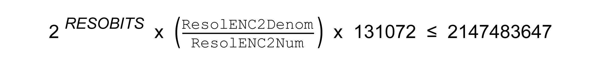

# Verifying the Maximum Position Value of the Machine Encoder

## Description

Each machine encoder with the interface EnDat 2.2, BiSS, or SSI has to be verified whether the maximum position value of the machine encoder exceeds the maximum positioning value of the drive.

The maximum position value of the machine encoder depends on two factors:

* The resolution of the machine encoder
* The [ratio between the motor encoder and machine encoder](D-SE-0071510.html#D-SE-0071510)

A formula can be used to calculate the maximum position value of the machine encoder.

If the maximum position value of the machine encoder exceeds the maximum positioning value of the drive you can ether change mechanical components (for example, use of a machine encoder with a lower resolution or use of a mechanical gear box with a lower ratio) or you can limit the resolution of the machine encoder via a parameter.

## Calculating the Maximum Position Value

The maximum position value of the machine encoder can be calculated using the following formula. The result must be lower or equal to 2147483647.

Definition of RESOBITS (resolution bits):

| Interface | Value for RESOBITS |
| --- | --- |
| Rotary EnDat 2.2 | Number of the bits of the singleturn resolution plus number of the bits of the multiturn resolution (see the technical data of the encoder for the values)(1) |
| Linear EnDat 2.2 | Number of the bits of the position resolution (see the technical data of the encoder for the values) |
| Rotary BiSS | Number of the bits of the singleturn resolution (same as parameter ENCDigBISSResSgl) plus number of the bits of the multiturn resolution (same as parameter ENCDigBISSResMul)(1) |
| Rotary SSI | Number of the bits of the singleturn resolution (same as parameter ENCDigSSIResSgl) plus number of the bits of the multiturn resolution (same as parameter ENCDigSSIResMult)(1) |
| Linear SSI | Number of the bits of the position resolution (same as parameter ENCDigSSILinRes) |
| **(1)** In case of singleturn encoder, the value for the bits of the multiturn resolution is 0. | |

If the maximum position value of the machine encoder exceeds the maximum positioning value of the drive and if the mechanical components cannot be modified, then you can limit the resolution of the machine encoder via a parameter.

NOTE: Limiting the resolution of the machine encoder considerably reduces the mechanical movement range.

## Limiting the Resolution of the Machine Encoder

For rotary encoders, the resolution of the machine encoder can be limited by specifying the number of bits used for the multiturn resolution via parameter ENCDigResMulUsed.

| Parameter name  HMI menu  HMI name | Description | Unit  Minimum value  Factory setting  Maximum value | Data type  R/W  Persistent  Expert | Parameter address via fieldbus |
| --- | --- | --- | --- | --- |
| ENCDigResMulUsed | Number of bits of the multiturn resolution used from the encoder.  Specifies the number of bits of the multiturn resolution used for position evaluation.  If ENCDigResMulUsed = 0, all bits of the multiturn resolution of the encoder are used.  Example:  If ENCDigResMulUsed = 11, only 11 bits of the multiturn resolution of the encoder are used.  Type: Unsigned decimal - 2 bytes  Write access via Sercos: CP2, CP3, CP4  Setting can only be modified if power stage is disabled.  Modified settings become active the next time the product is powered on. | bit  0  0  24 | UINT16  R/W  per.  - | Modbus 21014  IDN P-0-3082.0.11 |

For linear encoders, the resolution of the machine encoder can be limited by specifying the number of bits used for the position resolution via parameter ENCDigLinBitsUsed.

| Parameter name  HMI menu  HMI name | Description | Unit  Minimum value  Factory setting  Maximum value | Data type  R/W  Persistent  Expert | Parameter address via fieldbus |
| --- | --- | --- | --- | --- |
| ENCDigLinBitsUsed | Linear encoder: Number of bits of the position resolution used.  Specifies the number of bits of the position resolution used for position evaluation.  If ENCDigLinBitsUsed = 0, all position bits of the position resolution of the encoder are used.  Example:  If ENCDigLinBitsUsed = 22, only 22 bits of the position resolution of the encoder are used.  Type: Unsigned decimal - 2 bytes  Write access via Sercos: CP2, CP3, CP4  Setting can only be modified if power stage is disabled.  Modified settings become active the next time the product is powered on.  Available with firmware version ≥V01.06. | bit  0  0  31 | UINT16  R/W  per.  - | Modbus 21020  IDN P-0-3082.0.14 |

## Examples for Rotary Encoders

**Example 1:**

* Resolution singleturn bits: 17 bits
* Resolution multiturn bits: 12 bits
* Mechanical gear box: None
* Parameter ResolENC2Num: 131072
* Parameter ResolENC2Denom: 1

2(17+12) x (1/131072) x 131072 = 536870912

536870912 is less than 2147483647. No limitation of the resolution necessary.

**Example 2:**

* Resolution singleturn bits: 17 bits
* Resolution multiturn bits: 12 bits
* Mechanical gear box: 3:1
* Parameter ResolENC2Num: 131072
* Parameter ResolENC2Denom: 3

2(17+12) x (3/131072) x 131072 = 1610612736

1610612736 is less than 2147483647. No limitation of the resolution necessary.

**Example 3:**

* Resolution singleturn bits: 17 bits
* Resolution multiturn bits: 12 bits
* Mechanical gear box: 5:1
* Parameter ResolENC2Num: 131072
* Parameter ResolENC2Denom: 5

2(17+12) x (5/131072) x 131072 = 2684354560

2684354560 is greater than 2147483647. Change mechanical components (for example a machine encoder with a lower resolution or use of a mechanical gear box with a lower ratio) or limit the resolution of the machine encoder via the parameter ENCDigResMulUsed.

Limitation of the resolution of the machine encoder:

* Parameter ENCDigResMulUsed: 11

2(17+11) x (5/131072) x 131072 = 1342177280

1342177280 is less than 2147483647.

## Examples for Linear Encoders

**Example 1:**

* Resolution bits: 20 bits
* 10 motor revolutions correspond to 3000 encoder increments
* Parameter ResolENC2Num: 3000
* Parameter ResolENC2Denom: 10

220 x (10/3000) x 131072 = 458129845

458129845 is less than 2147483647. No limitation of the resolution necessary.

**Example 2:**

* Resolution bits: 24 bits
* 10 motor revolutions correspond to 6702 encoder increments
* Parameter ResolENC2Num: 6702
* Parameter ResolENC2Denom: 10

224 x (10/6702) x 131072 = 3281144816

3281144816 is greater than 2147483647. Change mechanical components (for example a machine encoder with a lower resolution or use of a mechanical gear box with a lower ratio) or limit the resolution of the machine encoder via the parameter ENCDigLinBitsUsed.

Limitation of the resolution of the machine encoder:

* Parameter ENCDigLinBitsUsed: 23

223 x (10/6702) x 131072 = 1640572408

1640572408 is less than 2147483647.

EIO0000003981.01

© 2021

Schneider Electric.

All rights reserved.