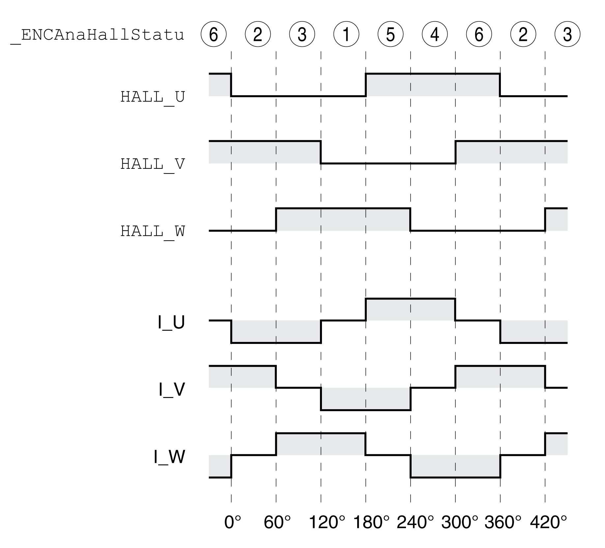

# Interface for Hall Effect Sensors

## Overview

The sequence of the Hall effect sensor signals must correspond to the pattern 2 - 3 - 1 - 5 - 4 - 6 as indicated in the following illustration.

The encoders of third-party motors may deliver a different pattern even though the designations HALL\_U, HALL\_V and HALL\_W are used. In such a case, the encoder pins HALL\_U, HALL\_V and HALL\_W must be wired differently.

## Verification of the Sequence

Observe and note the values of the parameter \_ENCAnaHallStatu in the commissioning software for one rotation of the motor shaft in positive direction of movement. Positive direction of rotation is when the motor shaft rotates clockwise as you look at the end of the protruding motor shaft.

The noted sequence must correspond to the pattern 2 - 3 - 1 - 5 - 4 - 6.

| Parameter name  HMI menu  HMI name | Description | Unit  Minimum value  Factory setting  Maximum value | Data type  R/W  Persistent  Expert | Parameter address via fieldbus |
| --- | --- | --- | --- | --- |
| \_ENCAnaHallStatu | Sequence of Hall effect sensor signals of analog encoder.  This parameter can be used to read the sequence of the Hall effect sensor signals of an analog encoder with the interface "SinCos 1Vpp (with Hall)".  Type: Unsigned decimal - 2 bytes | -  0  -  7 | UINT16  R/-  -  - | Modbus 20742  IDN P-0-3081.0.3 |

If the sequence noted is different, adapt the wiring of the Hall effect sensor:

* For sequence 4 - 5 - 1 - 3 - 2 - 6: interchange the Hall effect signals HALL\_U with HALL\_V.
* For sequence 1 - 3 - 2 - 6 - 4 - 5: interchange the Hall effect signals HALL\_V with HALL\_W.
* For sequence 4 - 6 - 2 - 3 - 1 - 5: interchange the Hall effect signals HALL\_U with HALL\_W, HALL\_V with HALL\_U and HALL\_W with HALL\_V.

NOTE: If the sequence noted is not listed above, your Hall effect sensor is not supported.

EIO0000003981.01

© 2021

Schneider Electric.

All rights reserved.