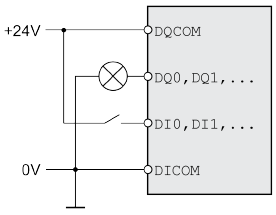

# Technical Data Safety Module eSM

## Environmental Conditions

The environmental conditions for the safety module eSM are identical to those specified for the drive. Refer to the user guide of the drive ([Related Documents](D-SE-0072280.3.html#D-SE-0072280.3__D-SE-0072280.13)) for the environmental conditions.

## Degree of Protection

The safety module eSM must be installed and operated in a control cabinet, secured by a keyed or tooled locking mechanism, with degree of protection IP54 or higher as per IEC 60529.

## Logic Type

The safety module eSM must be wired for positive logic.

| Logic type | Active state |
| --- | --- |
| Positive logic | Output supplies current (source output)  Current flows to the input (sink input) |

Refer to the user guide of the drive ([Related Documents](D-SE-0072280.3.html#D-SE-0072280.3__D-SE-0072280.13)) for additional information on the logic type.

## 24 V Power Supply

The 24 Vdc supply must meet the requirements of IEC 61131-2 (PELV standard power supply unit).

| Characteristic | Unit | Value |
| --- | --- | --- |
| Input voltage | Vdc | 24 (-15/+20%) |
| Nominal input current safety module eSM without load on outputs | A | ≤0.02 |
| Nominal input current eSM terminal adapter (accessory), without load on outputs | A | ≤0.05 |
| Residual ripple | % | <5 |

## Digital Inputs

The digital signal inputs are protected against reverse polarity.

| Characteristic | Unit | Value |
| --- | --- | --- |
| Voltage at level 0 | Vdc | -3 ... +5 |
| Voltage at level 1 | Vdc | +15 ... +30 |
| Nominal input current dual-channel input(1) | mA | 2.5 |
| Nominal input current single-channel input | mA | 5 |
| Debounce time | ms | ≥1 |
| Time window for simultaneous switching (both channels) | s | 1 |
| **(1)** Refer to [Wiring of Input Devices/Sensors](D-SE-0077589.html#D-SE-0077589) for additional information on inputs with suffixes ...\_A and ...\_B. | | |

## Digital Outputs

The digital signal outputs are short-circuit protected.

| Characteristic | Unit | Value |
| --- | --- | --- |
| Maximum inductive load | H | 20 (at 100 mA)  0.8 (at 500 mA) |
| Maximum capacitive load | μF | ≤ 1 |
| Maximum switching current RELAY\_OUT\_A, RELAY\_OUT\_B | A | ≤ 0.5 |
| Maximum switching current INTERLOCK\_OUT | A | ≤ 0.5 |
| Maximum switching current CCM24V\_OUT\_A, CCM24V\_OUT\_B | A | ≤ 0.3 |
| Maximum switching current AUXOUT1, AUXOUT2 | A | ≤ 0.1 |
| Voltage drop at 0.5 A | V | ≤ 1 |
| Deactivation time for test | ms | ≤ 1 |
| Maximum time for detection of cross circuits at activated outputs | s | ≤ 5 |

## Signal Duration Start/Restart and Acknowledge/Reset

The duration of the signals provided by a manual start/restart push-button and an acknowledge/reset push-button must be within the following limits:

| Characteristic | Unit | Value |
| --- | --- | --- |
| Signal duration manual start/restart push-button | s | 0.1 ... 2 |
| Signal duration acknowledge/reset push-button | s | 0.1 ... 2 |

## Response Times, Maximum Movement SOS, Maximum Motor-Induced Movement STO

| Characteristic | Unit | Value |
| --- | --- | --- |
| Triggering of emergency stop until beginning of SS1 | ms | ≤ 20 |
| Detection of invalid velocity (monitored velocity exceeded) | ms | ≤ 20 |
| Detection of invalid movement (monitored position value exceeded) | ms | ≤ 20 |
| Detection of invalid deceleration (monitored deceleration exceeded) | ms | ≤10 |
| Maximum movement with active SOS (trigger threshold for STO)(1) | inc | ± 25 |
| Maximum motor-induced movement with active STO | - | One half of motor pole pitch |
| **(1)** With reference to 1000 increments per revolution | | |

## Monitoring for Periodic Movement

If the power stage is enabled, the motor must perform a movement of at least two increments (with reference to 1000 increments per revolution) every 36 hours. This periodic movement is used to verify that the encoder is operative. If this periodic movement is not detected, an error is detected. The periodic movement is also monitored in the machine operating mode Automatic Mode.

## Safety Module eSM and Encoder Module

An additional encoder connected to the encoder module (encoder 2) can be used as a machine encoder or as a motor encoder. Refer to the user guide of the drive for additional information. The safety module eSM only monitors the signals of the encoder connected to connection CN3 of the drive. It does not monitor signals of encoders connected to the encoder module.

EIO0000004594.00

© 2021

Schneider Electric.

All rights reserved.