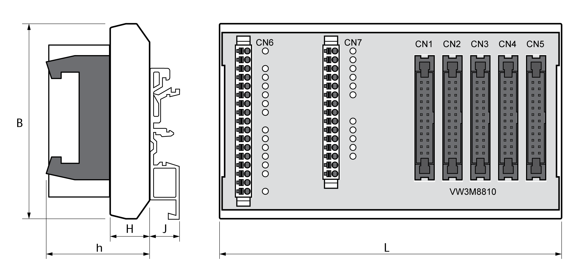

# Technical Data eSM Terminal Adapter

## Environmental Conditions

The environmental conditions for the eSM terminal adapter are identical to those specified for the drive. Refer to the user guide of the drive ([Related Documents](D-SE-0072280.3.html#D-SE-0072280.3__D-SE-0072280.13)) for the environmental conditions.

## Degree of Protection

The eSM terminal adapter may only be installed and operated in a control cabinet, secured by a keyed or tooled locking mechanism, with degree of protection IP54 or higher as per IEC 60529.

## Mounting

The eSM terminal adapter can be mounted to standard DIN rails or G-type rails.

## Dimensions eSM Terminal Adapter

Dimensions eSM terminal adapter:

|  |  |  |
| --- | --- | --- |
| Characteristic | Unit | Value |
| Space requirements (h + J + cable) | mm | ≥ 100 |
| B | mm | 78 |
| L | mm | 136 |
| Available space for unlocking the DIN rail | mm | ≥ 10 |

EIO0000004594.00

© 2021

Schneider Electric.

All rights reserved.