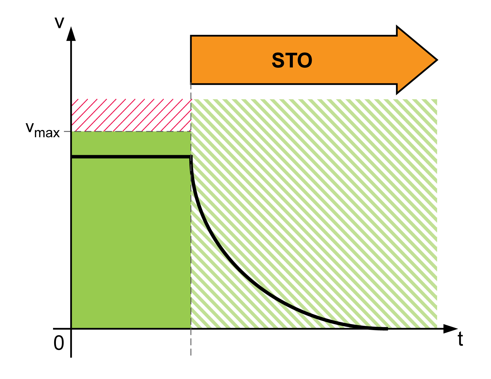

# Safety-Related Function STO

## Overview

The safety-related function STO (Safe Torque Off) keeps torque-producing or force-producing power from being provided to the motor. STO does not monitor for standstill.

EIO0000004594.00

© 2021

Schneider Electric.

All rights reserved.