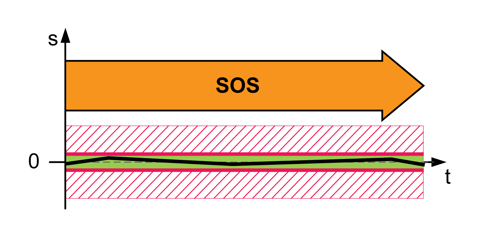

# Safety-Related Function SOS

## Overview

The safety-related function SOS (Safe Operating Stop) monitors the standstill position of the motor. If a movement of more than 25 increments with reference to 1000 increments per revolution is detected while SOS is active, the safety-related function STO is triggered.

## Response to Exceedance of Limit Value

If the monitored limit value is exceeded for the first time:

* An error is detected.
* The safety module eSM requests a Quick Stop from the drive and monitors the Quick Stop ramp.

  + If the Quick Stop is executed properly, the safety-related function SOS is triggered.
  + If the Quick Stop is not executed properly, the safety-related function STO is triggered.

If the monitored limit value is exceeded again:

* The safety-related function STO is triggered.

| Parameter name  HMI menu  HMI name | Description | Unit  Minimum value  Factory setting  Maximum value | Data type  R/W  Persistent  Expert | Parameter address via fieldbus |
| --- | --- | --- | --- | --- |
| eSM\_dec\_Qstop | eSM deceleration ramp for Quick Stop.  Deceleration ramp for monitored Quick Stop. This value must be greater than 0.  Value 0: eSM module is not configured  Value >0: Deceleration ramp in RPM/s  Type: Unsigned decimal - 4 bytes  Write access via Sercos: CP2, CP3, CP4  Setting can only be modified if power stage is disabled. | RPM/s  0  0  32786009 | UINT32  R/W  per.  - | - |

EIO0000004594.00

© 2021

Schneider Electric.

All rights reserved.